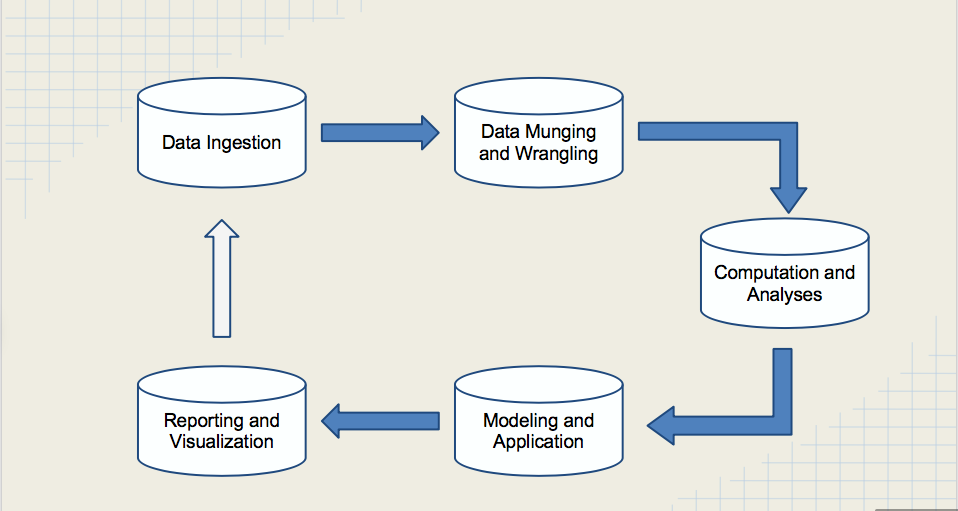
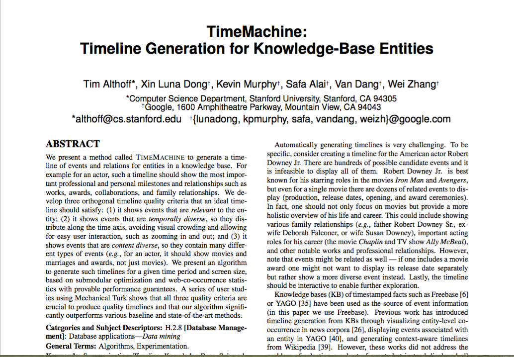

# A ~~Quick~~ Survey of Open Source Named Entity Extractor Tools for Python and Implementation of a Simplistic Ensemble Classifier

Named entity extraction is a core subtask to build knowledge from semi/unstructured text sources<sup><a href="#fn1" id="ref1">1</a></sup>.  Considering recent increases in computing power and decreases in the costs of data storage, data scientists and developers can build large knowledge bases that contain millions of entities and hundreds of millions of facts about them.  These knowledge bases are key contributors to intelligent computer behavior<sup><a href="#fn2" id="ref2">2</a></sup>.  Therefore, named entity extraction is at the core of several popular technologies such as smart assistants ([Siri](http://www.apple.com/ios/siri/), [Google Now](https://www.google.com/landing/now/)), machine reading, and deep interpretation of natural language<sup><a href="#fn3" id="ref3">3</a></sup>.

With a realization of how essential it is to recognize information units like names, including person, organization and location names, and numeric expressions including time, date, money
and percent expressions, several questions come to mind.  How do you perform named entity extraction, formally known as “[Named Entity Recognition and Classification (NERC)](https://benjamins.com/catalog/bct.19)”?  What tools are out there?  How can you evaluate their performance?  And most important, what works with Python (shamelessly exposing my bias)?  

This post will survey open source NERC tools and compare the results against hand labeled data for precision, accuracy, and recall.  The tools and basic information extraction principles in this discussion begin the process of structuring unstructured data.  Principles in this post can be used to perform more complex natural language processing piplines that derive unique insights from large collections of unstructured data.

We will specifically learn to:
1. follow the data science pipeline (see image below)
2. prepare semistructured natural language data for ingest using regex
3. create a custom corpus in [Natural Language Toolkit](http://www.nltk.org/) 
4. use a suite open source NERC tools to extract entities and store in json format; supports open data sharing principles
5. compare the performance of NERC tools
6. improve named entity extraction implementing a simplistic ensemble classifier

<br>
<a href="#pipe" id="pipeline"><center><h3>The Data Science Pipeline:<br>Practical Data Science Cookbook</h3></center></a>
<div class="image">

      
      
      

</div>


### Administrative Setup: Getting your environment exactly like mine...or close

The first thing we do is set up an environment that is exactly like the environment I used to process this data. I  used [Anaconda](https://www.continuum.io/why-anaconda), which is an easy-to-install, free package manager, environment manager, Python distribution, and collection of over 150 open source packages with free community support. I advise using Anaconda to recreate this work because, with a few lines of code, you can have all the dependencies used in this post with the exception of one function (email extractor).  

* [Install Anaconda](http://docs.continuum.io/anaconda/install)
    * verify that conda is installed using [these instructions](http://conda.pydata.org/docs/using/using.html#verify-that-conda-is-installed-check-current-conda-version)
* Download the [namedentity_requirements.yml](https://github.com/linwoodc3/LC3-Creations/blob/master/DDL/namedentityblog/namedentity_requirements.yml) (remember where you saved it on your computer)
* Follow the ["Use Environment from file"](http://conda.pydata.org/docs/using/envs.html#use-environment-from-file) instructions on Anaconda's website.

If you use some other method to set up a virtual environment, make sure you have all the files installed from my yml file. The one dependency not in the yml file is the email extractor.  [Cut and paste the function from this website](https://gist.github.com/dideler/5219706), save it to a .py file, and make sure it is in your sys.path or environment path.  

If you are running [this as an iPython notebook](https://github.com/linwoodc3/LC3-Creations/blob/master/DDL/namedentityblog/blogdraft.ipynb), stop here.  Go to the appendix and run all of the blocks of code before continuing. 

### The Data: Peer Reviewed Journals and Keynote Speaker Abstracts from KDD 2014 and 2015

Before delving into the pipeline, we need a good dataset.  Jason Brownlee had some good suggestions in his [August 2015 article](http://machinelearningmastery.com/practice-machine-learning-with-small-in-memory-datasets-from-the-uci-machine-learning-repository/) on picking a dataset for machine learning exercises:  

* **Real-World**: The datasets should be drawn from the real world (rather than being contrived). This will keep them interesting and introduce the challenges that come with real data.

* **Small**: The datasets need to be small so that you can inspect and understand them and that you can run many models quickly to accelerate your learning cycle.

* **Well-Understood**: There should be a clear idea of what the data contains, why it was collected, what the problem is that needs to be solved so that you can frame your investigation.

* **Baseline**: It is also important to have an idea of what algorithms are known to perform well and the scores they achieved so that you have a useful point of comparison. This is important when you are getting started and learning because you need quick feedback as to how well you are performing (close to state-of-the-art or something is broken).

* **Plentiful**: You need many datasets to choose from, both to satisfy the traits you would like to investigate and (if possible) your natural curiosity and interests. 

Luckily, we have a dataset that meets nearly all of these requirements.  I attended the Knowledge Discovery and Data Mining (KDD) conferences in [New York City (2014)](http://www.kdd.org/kdd2014/) and [Sydney, Australia (2015)](http://www.kdd.org/kdd2015/).  Both years, attendees received a USB with the conference proceedings.  Each repository contains over 230 peer reviewed journal articles and keynote speaker abstracts on data mining, knowledge discovery, big data, data science and their applications. The full conference proceedings can be purchased for \$60 at the [Association for Computing Machinery's Digital Library](https://dl.acm.org/purchase.cfm?id=2783258&CFID=740512201&CFTOKEN=34489585) (includes ACM membership). This post will work with a dataset that is equivalent to the conference proceedings and take semi-structured data (PDF journal articles and abstracts in publication format), strip text from the files, and add more structure to the data that would facilitate follow on analysis. 

<blockquote cite="https://github.com/linwoodc3/LC3-Creations/blob/master/DDL/namedentityblog/KDDwebscrape.ipynb">
Interested parties looking for a free option can use the <a href="https://pypi.python.org/pypi/beautifulsoup4/4.4.1">beautifulsoup</a> and <a href="https://pypi.python.org/pypi/requests/2.9.1">request</a> libraries to scrape the <a href="http://dl.acm.org/citation.cfm?id=2785464&CFID=740512201&CFTOKEN=3448958">ACM website for KDD 2015 conference data</a> that can be used in natural language processing pipelines.  I have some <a href="https://github.com/linwoodc3/LC3-Creations/blob/master/DDL/namedentityblog/KDDwebscrape.ipynb">skeleton web scraping code</a> to generate lists of all abstracts, author names, and journal/keynote address titles.    
</blockquote>


### Data Exploration: Getting the number of files, and file type 

The data is stored locally in the following directories:
```python
>>> import os
>>> print os.getcwd()
/Users/linwood/Desktop/KDD_15/docs
```
Let's explore the number of files we have and naming conventions. First, we cover administrative tasks of loading modules, establishing paths, etc.  
<br><br>


```
#**********************************************************************
# Importing what we need
#**********************************************************************
import os
import time
from os import walk

#**********************************************************************
# Administrative code to set the path for file loading
#**********************************************************************

path        = os.path.abspath(os.getcwd())

# This is where all of our journal articles and keynote abstracts live
TESTDIR     = os.path.normpath(os.path.join(os.path.expanduser("~"),"Desktop","KDD_15","docs"))
```

<br><br>To get a look at the naming conventions, we use a loop to iterate over the files in the directory and print out the filenames.  At the same time, we store each filename to a list, and do a *len* on the list to see how many files we are working with.<br><br>


```
# Establish an empty list to append filenames as we iterate over the directory with filenames
files = []

%time
start_time = time.time()

#**********************************************************************
# Core "workerbee" code for this section to iterate over directory files
#**********************************************************************

# Iterate over the directory of filenames and add to list.  Inspection shows our target filenames begin with 'p' and end with 'pdf'
for dirName, subdirList, fileList in os.walk(TESTDIR):
    for fileName in fileList:
        if fileName.startswith('p') and fileName.endswith('.pdf'):
            files.append(fileName)
end_time = time.time()

#**********************************************************************
# Output
#**********************************************************************
print
print len(files) # Print the number of files
print 
print '[%s]' % ', '.join(map(str, files)) # print the list of filenames
```

    CPU times: user 2 µs, sys: 3 µs, total: 5 µs
    Wall time: 5.01 µs
    
    253
    
    [p1.pdf, p1005.pdf, p1015.pdf, p1025.pdf, p1035.pdf, p1045.pdf, p1055.pdf, p1065.pdf, p1075.pdf, p1085.pdf, p109.pdf, p1095.pdf, p1105.pdf, p1115.pdf, p1125.pdf, p1135.pdf, p1145.pdf, p1155.pdf, p1165.pdf, p1175.pdf, p1185.pdf, p119.pdf, p1195.pdf, p1205.pdf, p1215.pdf, p1225.pdf, p1235.pdf, p1245.pdf, p1255.pdf, p1265.pdf, p1275.pdf, p1285.pdf, p129.pdf, p1295.pdf, p1305.pdf, p1315.pdf, p1325.pdf, p1335.pdf, p1345.pdf, p1355.pdf, p1365.pdf, p1375.pdf, p1385.pdf, p139.pdf, p1395.pdf, p1405.pdf, p1415.pdf, p1425.pdf, p1435.pdf, p1445.pdf, p1455.pdf, p1465.pdf, p1475.pdf, p1485.pdf, p149.pdf, p1495.pdf, p1503.pdf, p1513.pdf, p1523.pdf, p1533.pdf, p1543.pdf, p1553.pdf, p1563.pdf, p1573.pdf, p1583.pdf, p159.pdf, p1593.pdf, p1603.pdf, p1621.pdf, p1623.pdf, p1625.pdf, p1627.pdf, p1629.pdf, p1631.pdf, p1633.pdf, p1635.pdf, p1637.pdf, p1639.pdf, p1641.pdf, p1651.pdf, p1661.pdf, p1671.pdf, p1681.pdf, p169.pdf, p1691.pdf, p1701.pdf, p1711.pdf, p1721.pdf, p1731.pdf, p1741.pdf, p1751.pdf, p1759.pdf, p1769.pdf, p1779.pdf, p1789.pdf, p179.pdf, p1799.pdf, p1809.pdf, p1819.pdf, p1829.pdf, p1839.pdf, p1849.pdf, p1859.pdf, p1869.pdf, p1879.pdf, p1889.pdf, p189.pdf, p1899.pdf, p19.pdf, p1909.pdf, p1919.pdf, p1929.pdf, p1939.pdf, p1949.pdf, p1959.pdf, p1969.pdf, p1979.pdf, p1989.pdf, p199.pdf, p1999.pdf, p2009.pdf, p2019.pdf, p2029.pdf, p2039.pdf, p2049.pdf, p2059.pdf, p2069.pdf, p2079.pdf, p2089.pdf, p209.pdf, p2099.pdf, p2109.pdf, p2119.pdf, p2127.pdf, p2137.pdf, p2147.pdf, p2157.pdf, p2167.pdf, p2177.pdf, p2187.pdf, p219.pdf, p2197.pdf, p2207.pdf, p2217.pdf, p2227.pdf, p2237.pdf, p2247.pdf, p2257.pdf, p2267.pdf, p2277.pdf, p2287.pdf, p229.pdf, p2297.pdf, p2307.pdf, p2309.pdf, p2311.pdf, p2313.pdf, p2315.pdf, p2317.pdf, p2319.pdf, p2321.pdf, p2323.pdf, p2325.pdf, p2327.pdf, p2329.pdf, p239.pdf, p249.pdf, p259.pdf, p269.pdf, p279.pdf, p289.pdf, p29.pdf, p299.pdf, p3.pdf, p309.pdf, p319.pdf, p329.pdf, p339.pdf, p349.pdf, p359.pdf, p369.pdf, p379.pdf, p387.pdf, p39.pdf, p397.pdf, p407.pdf, p417.pdf, p427.pdf, p437.pdf, p447.pdf, p457.pdf, p467.pdf, p477.pdf, p487.pdf, p49.pdf, p497.pdf, p5.pdf, p507.pdf, p517.pdf, p527.pdf, p537.pdf, p547.pdf, p557.pdf, p567.pdf, p577.pdf, p587.pdf, p59.pdf, p597.pdf, p607.pdf, p617.pdf, p627.pdf, p635.pdf, p645.pdf, p655.pdf, p665.pdf, p675.pdf, p685.pdf, p69.pdf, p695.pdf, p7.pdf, p705.pdf, p715.pdf, p725.pdf, p735.pdf, p745.pdf, p755.pdf, p765.pdf, p775.pdf, p785.pdf, p79.pdf, p805.pdf, p815.pdf, p825.pdf, p835.pdf, p845.pdf, p855.pdf, p865.pdf, p875.pdf, p885.pdf, p89.pdf, p895.pdf, p9.pdf, p905.pdf, p915.pdf, p925.pdf, p935.pdf, p945.pdf, p955.pdf, p965.pdf, p975.pdf, p985.pdf, p99.pdf, p995.pdf]


<br><br>There are 253 total files in the directory. Here is a screen capture for how the journal articles look in the PDF viewer:<br><br>





<br><br>We learn a few things immediately. Our data is in PDF format and it's semistructured (follows journal article format with sections like "abstract", "title").  PDFs are a wonderful human readable presentation of data. But for data analyisis, they are extremely difficult to work with.  If you have an option to get the data BEFORE it was converted to or added to PDF, go for that option.  If PDFs are your only option, be prepared for a lot of these moments:


In today's exercise, we have no alternatives outside of the web scraping code linked above.  In full disclosure, that code is imperfect because we get an incomplete dataset.  The abstracts and authors are not matched to the papers and we don't pull in the references section. <br><br>

### Data Ingestion: Stripping text from PDFs and creating a custom NLTK corpus

The first step in the <href id="pipe"><a href="#pipeline" title="Jump back to data science pipeline graphic.">data science pipeline</a> is to ingest our data into the environment for analysis.  We use several Python tools which include:

* [pdfminer](https://pypi.python.org/pypi/pdfminer/) - this is the tool that makes it ALL happen.  It has a command line tool called "pdf2text.py" that extract text contents from a PDF. **This must be installed on your computer BEFORE executing this code**.  Visit the [pdfminer homepage](http://euske.github.io/pdfminer/index.html#pdf2txt) for instructions

* [subprocess](https://docs.python.org/2/library/subprocess.html) - a standard library module that allows you to spawn new processes, connect to their input/output/error pipes, and obtain their return codes.  In this excerise, we use it to invoke the pdf2texy.py command line tool within our code.  

* [nltk](http://www.nltk.org/) - another work horse in this exercise.  The Natural Language ToolKit (NLTK) is one of Python's leading platforms to analyze natural language data.  The [NLTK Book](http://www.nltk.org/book/) provides practical guidance on how to handle just about any natural language preprocessing job.  

* [string](https://docs.python.org/2/library/string.html) - used for variable substitutions and value formatting to strip non printable characters from the output of the text extracted from our journal article PDFs

* [unicodedata](https://docs.python.org/2/library/unicodedata.html) - some unicode characters won't extract nicely. This library allows latin unicode characters to degrade gracefully into ASCII.

Similar to our exploration steps above, we will iterate over the files in the directory, but with a few new steps.  This time, we will strip the text, and write the *.txt* file to newly created directory.  If we were using AWS, we would write these .txt files to [Amazon's Simple Storage Service (S3)](https://aws.amazon.com/s3/).  Next up, we use the simple instructions from [Section 1.9, Chapter 2 of NLTK's Book](http://www.nltk.org/book/ch02.html) to build a custom corpus.  Having our target documents loaded as an NLTK corpus brings the power of NLTK to our analysis goals.  Let's begin with administrative tasks such as loading modules and creating the necessary directories.  We aren't doing much in this post, but if you are doing more complex NLP jobs, it could save a lot of trouble. Here's the code to accomplish what's discussed above:<br><br>


```
#**********************************************************************
# Importing what we need
#**********************************************************************
import string
import unicodedata
import subprocess
import nltk
import os, os.path
import re

#**********************************************************************
# Create the directory we will write the .txt files to after stripping text
#**********************************************************************

corpuspath = os.path.normpath(os.path.expanduser('~/Desktop/KDD_corpus/'))
if not os.path.exists(corpuspath):
    os.mkdir(corpuspath)
```

<br><br>Now we are to the big task of stripping text from the PDFs.  In the code below, we walk down the directory, and strip text from the files with names that begin with 'p' and end with 'pdf', based on our exploration of naming convenstions agove.  We use the *fileName* variable to name the files we write to disk.  Keep in mind, this task takes the longest, so be prepared to wait a few minutes depending on the processing power of your computer.  If you are doing this in a distributed cloud environment with thousands of documents, take advantage of the ability to spin up compute resources, to reduce your wait time.  Our code to accomplish the task mentioned:<br><br>


```
#**********************************************************************
# Core code to iterate over files in the directory
#**********************************************************************

# We start from the code to iterate over the files
%timeit
for dirName, subdirList, fileList in os.walk(TESTDIR):
    for fileName in fileList:
        if fileName.startswith('p') and fileName.endswith('.pdf'):
            if os.path.exists(os.path.normpath(os.path.join(corpuspath,fileName.split(".")[0]+".txt"))):
                pass
            else:
            
            
#**********************************************************************
# This code strips the text from the PDFs
#**********************************************************************
                try:
                    document = filter(lambda x: x in string.printable,unicodedata.normalize('NFKD', (unicode(subprocess.check_output(['pdf2txt.py',str(os.path.normpath(os.path.join(TESTDIR,fileName)))]),errors='ignore'))).encode('ascii','ignore').decode('unicode_escape').encode('ascii','ignore'))
                except UnicodeDecodeError:
                    document = unicodedata.normalize('NFKD', unicode(subprocess.check_output(['pdf2txt.py',str(os.path.normpath(os.path.join(TESTDIR,fileName)))]),errors='ignore')).encode('ascii','ignore')    

                if len(document)<300:
                    pass
                else:
                    # used this for assistance http://stackoverflow.com/questions/2967194/open-in-python-does-not-create-a-file-if-it-doesnt-exist
                    if not os.path.exists(os.path.normpath(os.path.join(corpuspath,fileName.split(".")[0]+".txt"))):
                        file = open(os.path.normpath(os.path.join(corpuspath,fileName.split(".")[0]+".txt")), 'w+')
                        file.write(document)
                    else:
                        pass

# This code builds our custom corpus.  The corpus path is a path to where we saved all of our .txt files of stripped text                    
kddcorpus= nltk.corpus.PlaintextCorpusReader(corpuspath, '.*\.txt')
```


```
# if you've already run the code block above and built the .txt files, use this single line if you restart the kernel; saves time
kddcorpus= nltk.corpus.PlaintextCorpusReader(corpuspath, '.*\.txt')
```

<br><br>This is a pretty big step.  We have a semi-structured data set in a format where we can query and analyze different pieces of data.  All of our data is loaded as an NLTK corpus, meaning we could try tons of techniques outlined in the [NLTK book](http://www.nltk.org/book/) or use the NLTK APIs to pass data into [scikit-learn machine learning pipelines for text](http://scikit-learn.org/stable/tutorial/text_analytics/working_with_text_data.html) (maybe for a later blog). Let's see how many words (including stop words) we have in our entire corpus. This is a part of exploring our dataset, as laid out in a great book on Data Science<sup><a href="#fn4" id="ref4">4</a></sup>  <br><br>


```
wordcount = 0
for fileid in kddcorpus.fileids():
    wordcount += len(kddcorpus.words(fileid))
print wordcount

```

    2795267


This step didn't come off without it's errors.  We got a little bit of gobbledygook (that is a [real word](http://www.merriam-webster.com/dictionary/gobbledygook) by the way). Here are the first 1000 characters of document 2157:


```
print kddcorpus.raw("p2157.txt")[:1000]
```

    )UDX'HWHFWRU$*UDSK0LQLQJEDVHG)UDPHZRUN
    
    IRU)UDXGXOHQW3KRQH&DOO'HWHFWLRQ
    
    -RVK-LD&KLQJ<LQJ&KH:HL+XDQJ<LPLQ.DRDQG.XDQ7D&KHQ
    
    'HSDUWPHQWRI&RPSXWHU6FLHQFH1DWLRQDO&KLDR7XQJ8QLYHUVLW\7DLZDQ52&
    
    'HSDUWPHQWRI&RPSXWHU6FLHQFHDQG,QIRUPDWLRQ(QJLQHHULQJ1DWLRQDO&KHQJ.XQJ8QLYHUVLW\7DLZDQ52&
    
    *RJRORRN&R/WG7DLZDQ52&
    
    ,QVWLWXWHRI,QIRUPDWLRQ6FLHQFH$FDGHPLD6LQLFD7DLZDQ52&
    
    MDVK\LQJ#JPDLOFRPZHLLER\#LGEFVLHQFNXHGXWZ\LPLQNDR#JRJRORRNFRPVZF#LLVVLQLFDHGXWZ
    
    &RUUHVSRQGHQFH YWVHQJ#FVQFWXHGXWZ
    
    $%675$&7
    ,QUHFHQW\HDUVIUDXGLVLQFUHDVLQJUDSLGO\ZLWKWKHGHYHORSPHQWRI
    PRGHUQ WHFKQRORJ\ DQG JOREDO FRPPXQLFDWLRQ $OWKRXJK PDQ\
    OLWHUDWXUHV KDYH DGGUHVVHG WKH IUDXG GHWHFWLRQ SUREOHP WKHVH
    H[LVWLQJ ZRUNV IRFXV RQO\ RQ IRUPXODWLQJ WKH IUDXG GHWHFWLRQ
    SUREOHP DV D ELQDU\ FODVVLILFDWLRQ SUREOHP 'XH WR OLPLWDWLRQ RI
    LQIRUPDWLRQSURYLGHGE\WHOHFRPPXQL


<br>I could never figure out what caused the error above but that's a dose of real world data problems. The NLTK book has an [excellent section on processing raw text and unicode issues](http://www.nltk.org/book/ch03.html#fig-unicode).  They discuss some problems I've encountered above.  Let's move on and begin pieces of the next step.  To begin our exploration of regular expressions (aka "regex"), it's important to point out some good resources to brush up on the topic.  The best resource I have experienced was in [Videos 1-3, Week 4, Getting and Cleaning Data, Data Science Specialization Track](https://www.coursera.org/learn/data-cleaning) (At Coursera by Johns Hopkins University).  The instruction and examples in these helped me UNDERSTAND how to use regex vice googling ["how to match text between two strings python regex"](https://www.google.com/webhp?sourceid=chrome-instant&ion=1&espv=2&ie=UTF-8#q=how+to+match+text+between+two+strings+python+regex) and hacking away until getting the desired output.  When you understand regex, you will start to use metacharacter expression matches vice using literal matches, and crush any text matching requirement.  Here are some learning resources listed in my own subjective order of usefulness and relevance to python:
* http://regexone.com/ (interactive teaching)
* https://regex101.com/ (interactive testing; you can paste your text and test expressions)
* http://regexr.com/ (interactive testing like above)
* http://www.learnpython.org/en/Regular_Expressions (not very intuitive at first glimpse, but useful)
* https://docs.python.org/2/library/re.html (default Python library documentation on regex)

<br>As a quick test, we extract some "good enough" titles from the first 26 documents. I say "good enough" because some author names get caught up int he extractions below.  <br><br>


```
# This title extraction is probably unnecessarily complex, but it gets the job done; we make use of the metacharacters vice literal matches

p=re.compile('^(.*)([\s]){2}[A-z]+[\s]+[\s]?.+')# matches text, starting from beginning of line, followed by at least two
for fileid in kddcorpus.fileids()[:25]:
    print re.search('^(.*)[\s]+[\s]?(.*)?',kddcorpus.raw(fileid)).group(1).strip()+" "+re.search('^(.*)[\s]+[\s]?(.*)?',kddcorpus.raw(fileid)).group(2).strip()
      # use .strip() to remove whitespace from beginning and end of string
```

    Online Controlled Experiments: Lessons from Running A/B/n Tests for 12 Years
    Mining Frequent Itemsets through Progressive Sampling with Rademacher Averages
    Why It Happened: Identifying and Modeling the Reasons of the Happening of Social Events
    Matrix Completion with Queries Natali Ruchansky
    Stochastic Divergence Minimization for Online Collapsed Variational Bayes Zero Inference
    Bayesian Poisson Tensor Factorization for Inferring Multilateral Relations from Sparse Dyadic Event Counts
    TimeCrunch: Interpretable Dynamic Graph Summarization Neil Shah
    Inside Jokes: Identifying Humorous Cartoon Captions Dafna Shahaf
    Community Detection based on Distance Dynamics Junming Shao
    Discovery of Meaningful Rules in Time Series Mohammad Shokoohi-Yekta    Yanping Chen    Bilson Campana    Bing Hu
    On the Formation of Circles in Co-authorship Networks Tanmoy Chakraborty1, Sikhar Patranabis2, Pawan Goyal3, Animesh Mukherjee4
    An Evaluation of Parallel Eccentricity Estimation Algorithms on Undirected Real-World Graphs
    Efcient Latent Link Recommendation in Signed Networks
    Turn Waste into Wealth: On Simultaneous Clustering and Cleaning over Dirty Data
    Set Cover at Web Scale Stergios Stergiou
    Exploiting Relevance Feedback in Knowledge Graph Search
    LINKAGE: An Approach for Comprehensive Risk Prediction for Care Management
    Transitive Transfer Learning Ben Tan
    PTE: Predictive Text Embedding through Large-scale Heterogeneous Text Networks
    An Effective Marketing Strategy for Revenue Maximization with a Quantity Constraint
    Scaling Up Stochastic Dual Coordinate Ascent Kenneth Tran
    Heterogeneous Network Embedding via Deep Architectures
    Discovering Valuable Items from Massive Data Hastagiri P Vanchinathan
    Deep Learning Architecture with Dynamically Programmed Layers for Brain Connectome Prediction
    Incorporating World Knowledge to Document Clustering via Heterogeneous Information Networks


### Data wrangling and munging: Using Regular Expressions to extract specific sections of the paper

The next step in the <href id="pipe"><a href="#pipeline" title="Jump back to data science pipeline graphic.">data science pipeline</a> is the most time consuming; data wrangling.  For simplicity, let's focus on wrangling the data so we can use the NERC on two sections of the paper:
* the top section which includes authors and schools; this is all text above the abstract
* the references section of the paper (keynote speaker abstracts do not have an abstract)

The regex tools of choice to extract sections are the ["positive lookbehind" and "positive lookahead"](https://docs.python.org/2/library/re.html) expressions. Here is an example of code to extract the abstract only:<br>


```
# set our regular expression
p= re.compile('(?<=ABSTRACT)(.+)(?=Categories and Subject Descriptors)')
try:
    abstract= p.search(re.sub('[\s]'," ",kddcorpus.raw('p1035.txt'))).group(1)
except AttributeError:
    # include a lowercase regex match incase consistency is a problem
    p=re.compile('(?<=abstract)(.+)(?=categories and subject descriptors)')
    abstract=p.search(re.sub('[\s]'," ",holder.lower())).group(1)
else:
    pass
unicodedata.normalize('NFKD', abstract).encode('ascii','ignore').strip() # convert output from unicode to string and strip leading and trailing whitespace
```


    'The collapsed variational Bayes zero (CVB0) inference is a vari- ational inference improved by marginalizing out parameters, the same as with the collapsed Gibbs sampler. A drawback of the CVB0 inference is the memory requirements. A probability vec- tor must be maintained for latent topics for every token in a corpus. When the total number of tokens is N and the number of topics is K, the CVB0 inference requires O(N K) memory. A stochas- tic approximation of the CVB0 (SCVB0) inference can reduce O(N K) to O(V K), where V denotes the vocabulary size. We re- formulate the existing SCVB0 inference by using the stochastic di- vergence minimization algorithm, with which convergence can be analyzed in terms of Martingale convergence theory. We also reveal the property of the CVB0 inference in terms of the leave-one-out perplexity, which leads to the estimation algorithm of the Dirichlet distribution parameters. The predictive performance of the propose SCVB0 inference is better than that of the original SCVB0 infer- ence in four datasets.'


Nice!  Now, to be "pythonic" we build two functions that can extract the top and references sections of the documents.  For fun, I also made other functions to extract the keywords and abstract sections of the documents.  We could do the same for any section of paper although I must provide a warning.  **Working with natural language is a messy ordeal!**  This corpus comes from a top notch data mining organization but human error and a lack of standardization makes it way into the picture:


Specifically in our case:
* paper 1 header section = "Categories and Subject Descriptors"
* paper 2 header section = "Categories & Subject Descriptors"

That may seem like a small difference but these types of differences cause TONS of headaches.  The result?  You have a decision to make: **account for these differences or ignore them**.  I worked to include AS MUCH of the 253 corpus as possible in the results but it's never perfect.  There are also some documents that will be missing sections altogether (i.e. keynote speaker documents do not have a references section.  Our two functions will:

1. Extract only the relevant text for the section we seek
2. Extract a character count for the section
3. Make additonal calculations or extractions
  * the top section extraction also extracts emails
  * we count the number of references and store that value
  * as added benefit, we create a simple "word per reference" calculation for the reference extraction
4. Store all the above data as a nested dictionary with the filename as a key

These extraction jobs are loooooong blocks of code to accomplish the task above.  For now, we will only show the code to extract the references section and push the other functions to the appendix for those who are interested.  In fairness, all functions could be reduced down to one function composed of nested function calls.  Code optimization is a worthy goal, but right now, we're just looking for functions that "function".  Here is a block of code to extract references:


```
# Code to pull the ferences section only, store a character count, number of references, and "word per reference" calculation

def refpull(docnum=None,section='references',full = False):
    
    # Establish an empty dictionary to hold values
    ans={}
    
    # Establish an empty list to hold document ids that don't make the cut (i.e. missing reference section or different format)
    # This comes in handy when you are trying to improve your code to catch outliers
    failids = []
    section = section.lower()    
    
    # Admin code to set default values and raise an exception if there's human error on input
    if docnum is None and full == False:
        raise BaseException("Enter target file to extract data from")
    
    if docnum is None and full == True:
        
        # Setting the target document and the text we will extract from 
        text=kddcorpus.raw(docnum)
        
        
        # This first condtional is for pulling the target section for ALL documents in the corpus
        if full == True:
            
            # Iterate over the corpus to get the id; this is possible from loading our docs into a custom NLTK corpus
            for fileid in kddcorpus.fileids():
                text = kddcorpus.raw(fileid)
                
                # These lines of code build our regular expression.
                # In the other functions for abstract or keywords, you see how I use this technique to create different regex arugments
                if section == "references":
                    section1=["REFERENCES"] 
                    
                    # Just in case, making sure our target string is empty before we pass data into it; just a check
                    target = ""   

                    #We now build our lists iteratively to build our regex
                    for sect in section1:
                        
                        # We embed exceptions to remove the possibility of our code stopping; we pass failed passes into a list
                        try:
                            
                            # our machine built regex
                            part1= "(?<="+sect+")(.+)"
                            p=re.compile(part1)
                            target=p.search(re.sub('[\s]'," ",text)).group(1)
                            
                            # Conditoin to make sure we don't get any empty string
                            if len(target) > 50:

                                # calculate the number of references in a journal; finds digits between [] in references section only
                                try:
                                    refnum = len(re.findall('\[(\d){1,3}\]',target))+1
                                except:
                                    print "This file does not appear to have a references section"
                                    pass
                                
                                #These are all our values; we build a nested dictonary and store the calculated values
                                ans[str(fileid)]={}
                                ans[str(fileid)]["references"]=target.strip()
                                ans[str(fileid)]["charcount"]=len(target)
                                ans[str(fileid)]["refcount"]= refnum
                                ans[str(fileid)]["wordperRef"]=round(float(len(nltk.word_tokenize(text)))/float(refnum))
                                #print [fileid,len(target),len(text), refnum, len(nltk.word_tokenize(text))/refnum]
                                break
                            else:

                                pass
                        except AttributeError:
                            failids.append(fileid)
                            pass

            return ans
            return failids
                              
        # This is to perform the same operations on just one document; same functionality as above.
    else:
        ans = {}
        failids=[]
        text = kddcorpus.raw(docnum)
        
        if section == "references":
            section1=["REFERENCES"] 
            target = ""   
            for sect in section1:
                try:
                    part1= "(?<="+sect+")(.+)"
                    p=re.compile(part1)
                    target=p.search(re.sub('[\s]'," ",text)).group(1)
                    if len(target) > 50:
                        # calculate the number of references in a journal; finds digits between [] in references section only
                        try:
                            refnum = len(re.findall('\[(\d){1,3}\]',target))+1
                        except:
                            print "This file does not appear to have a references section"
                            pass
                        ans[str(docnum)]={}
                        ans[str(docnum)]["references"]=target.strip()
                        ans[str(docnum)]["charcount"]=len(target)
                        ans[str(docnum)]["refcount"]= refnum
                        ans[str(docnum)]["wordperRef"]=float(len(nltk.word_tokenize(text)))/float(refnum)


                        #print [fileid,len(target),len(text), refnum, len(nltk.word_tokenize(text))/refnum]
                        break
                    else:

                        pass
                except AttributeError:
                    failids.append(docnum)
                    pass
        
        
        
        return ans
        return failids
```

That's a big block of code!  Remember, there are similar blocks of code for other sections in the paper.  One could also write their own to retrieve only the body, the first paragraph, figure text, etc.  Data is messy; this is what cleaning looks like.  In the code above, we also make use of the *nltk.word_tokenize* tool to create the "word per reference" figure.  Let's test references function and look at the output (**NOTE: the word_tokenize calculation will take some time to run**):


```
# call our function, setting "full=True" extracts ALL references in corpus
test = refpull(full=True)

# To get a quick glimpse, I use the example from this page: http://stackoverflow.com/questions/7971618/python-return-first-n-keyvalue-pairs-from-dict
import itertools
import collections

man = collections.OrderedDict(test)

x = itertools.islice(man.items(), 0, 10)
```

With that done, we will make a pretty output of the data using something a [tabulate](https://pypi.python.org/pypi/tabulate) module. The joy of Python is, someone has already made a tool to do exactly what you're thinking about. Tabulate makes the standard print output into a more organized "pretty" format.  Let's write the code and give it a go:


```
# Let's use a nifty table module to print this all pretty like: https://pypi.python.org/pypi/tabulate
# The joy of Python and open source: someone has created something to do what you want; Google is your friend.  

from tabulate import tabulate

# A quick list comprehension to follow the example on the tabulate pypi page
table = [[key,value['charcount'],value['refcount'], value['wordperRef']] for key,value in x]

# print the pretty table; we invoke the "header" argument and assign custom header!!!!
print tabulate(table,headers=["filename","Character Count", "Number of references","Words per Reference"])
```

    filename      Character Count    Number of references    Words per Reference
    ----------  -----------------  ----------------------  ---------------------
    p2277.txt                6295                      33                    326
    p835.txt                 5347                      38                    319
    p865.txt                 5269                      27                    399
    p2089.txt                8734                      45                    181
    p1759.txt                3677                      31                    405
    p29.txt                  5101                      40                    265
    p2227.txt               10345                      36                    332
    p2099.txt                3949                      28                    374
    p725.txt                 5771                      37                    304
    p2019.txt                9101                      60                    171


### Computation,analyses, modeling, application: Using NERC tools and examining for accuracy

Finally, we are in <href id="pipe"><a href="#pipeline" title="Jump back to data science pipeline graphic.">data science pipeline</a> steps where data scientists WANT to live: computation, analyses, modeling and application!!!   Notice I've mixed the next two steps because we are using models, applying them to our data, and performing analysis below.

We can now test how well some open source NERC tools extract entities from the top and reference sections of our corpus.  By top section, I am referring to all text that occurs before the keyFor comparison, I went through and hand labled entities in two documents.  Hand labeling is an expensive and tedious process.  For two documents, we have the hand labeled authors, organizations, and locations from the top section of the article.  Second, there is a list of all authors from the references section and finally, a list of all combined authors (person entities) in the top and reference section combined. I've only done two (2) documents, but that is 295 cut-and-pastes of names or organizations. Let's take a look:


```
# filename p19.txt

p19pdf_authors=['Tim Althoff','Xin Luna Dong','Kevin Murphy','Safa Alai','Van Dang','Wei Zhang']
p19pdf_author_organizations=['Computer Science Department','Stanford University','Google']
p19pdf_author_locations=['Stanford, CA','1600 Amphitheatre Parkway, Mountain View, CA 94043','Mountain View']

p19pdf_references_authors =['A. Ahmed', 'C. H. Teo', 'S. Vishwanathan','A. Smola','J. Allan', 'R. Gupta', 'V. Khandelwal',
                           'D. Graus', 'M.-H. Peetz', 'D. Odijk', 'O. de Rooij', 'M. de Rijke','T. Huet', 'J. Biega', 
                            'F. M. Suchanek','H. Ji', 'T. Cassidy', 'Q. Li','S. Tamang', 'A. Kannan', 'S. Baker', 'K. Ramnath', 
                            'J. Fiss', 'D. Lin', 'L. Vanderwende',  'R. Ansary', 'A. Kapoor', 'Q. Ke', 'M. Uyttendaele',
                           'S. M. Katz','A. Krause','D. Golovin','J. Leskovec', 'A. Krause', 'C. Guestrin', 'C. Faloutsos', 
                            'J. VanBriesen','N. Glance','J. Li','C. Cardie','J. Li','C. Cardie','C.-Y. Lin','H. Lin','J. A. Bilmes'
                           'X. Ling','D. S. Weld', 'A. Mazeika', 'T. Tylenda','G. Weikum','M. Minoux', 'G. L. Nemhauser', 'L. A. Wolsey',
                            'M. L. Fisher','R. Qian','D. Shahaf', 'C. Guestrin','E. Horvitz','T. Althoff', 'X. L. Dong', 'K. Murphy', 'S. Alai',
                            'V. Dang','W. Zhang','R. A. Baeza-Yates', 'B. Ribeiro-Neto', 'D. Shahaf', 'J. Yang', 'C. Suen', 'J. Jacobs', 'H. Wang', 'J. Leskovec',
                           'W. Shen', 'J. Wang', 'J. Han','D. Bamman', 'N. Smith','K. Bollacker', 'C. Evans', 'P. Paritosh', 'T. Sturge', 'J. Taylor',
                           'R. Sipos', 'A. Swaminathan', 'P. Shivaswamy', 'T. Joachims','K. Sprck Jones','G. Calinescu', 'C. Chekuri', 'M. Pl','J. Vondrk',
                           'F. M. Suchanek', 'G. Kasneci','G. Weikum', 'J. Carbonell' ,'J. Goldstein','B. Carterette', 'P. N. Bennett', 'D. M. Chickering',
                            'S. T. Dumais','A. Dasgupta', 'R. Kumar','S. Ravi','Q. X. Do', 'W. Lu', 'D. Roth','X. Dong', 'E. Gabrilovich', 'G. Heitz', 'W. Horn', 
                            'N. Lao', 'K. Murphy',  'T. Strohmann', 'S. Sun','W. Zhang', 'M. Dubinko', 'R. Kumar', 'J. Magnani', 'J. Novak', 'P. Raghavan','A. Tomkins',
                           'U. Feige','F. M. Suchanek','N. Preda','R. Swan','J. Allan', 'T. Tran', 'A. Ceroni', 'M. Georgescu', 'K. D. Naini', 'M. Fisichella',
                           'T. A. Tuan', 'S. Elbassuoni', 'N. Preda','G. Weikum','Y. Wang', 'M. Zhu', 'L. Qu', 'M. Spaniol', 'G. Weikum',
                           'G. Weikum', 'N. Ntarmos', 'M. Spaniol', 'P. Triantallou', 'A. A. Benczr',  'S. Kirkpatrick', 'P. Rigaux','M. Williamson',
                           'X. W. Zhao', 'Y. Guo', 'R. Yan', 'Y. He','X. Li']

p19pdf_allauthors=['Tim Althoff','Xin Luna Dong','Kevin Murphy','Safa Alai','Van Dang','Wei Zhang','A. Ahmed', 'C. H. Teo', 'S. Vishwanathan','A. Smola','J. Allan', 'R. Gupta', 'V. Khandelwal',
                           'D. Graus', 'M.-H. Peetz', 'D. Odijk', 'O. de Rooij', 'M. de Rijke','T. Huet', 'J. Biega', 
                            'F. M. Suchanek','H. Ji', 'T. Cassidy', 'Q. Li','S. Tamang', 'A. Kannan', 'S. Baker', 'K. Ramnath', 
                            'J. Fiss', 'D. Lin', 'L. Vanderwende',  'R. Ansary', 'A. Kapoor', 'Q. Ke', 'M. Uyttendaele',
                           'S. M. Katz','A. Krause','D. Golovin','J. Leskovec', 'A. Krause', 'C. Guestrin', 'C. Faloutsos', 
                            'J. VanBriesen','N. Glance','J. Li','C. Cardie','J. Li','C. Cardie','C.-Y. Lin','H. Lin','J. A. Bilmes'
                           'X. Ling','D. S. Weld', 'A. Mazeika', 'T. Tylenda','G. Weikum','M. Minoux', 'G. L. Nemhauser', 'L. A. Wolsey',
                            'M. L. Fisher','R. Qian','D. Shahaf', 'C. Guestrin','E. Horvitz','T. Althoff', 'X. L. Dong', 'K. Murphy', 'S. Alai',
                            'V. Dang','W. Zhang','R. A. Baeza-Yates', 'B. Ribeiro-Neto', 'D. Shahaf', 'J. Yang', 'C. Suen', 'J. Jacobs', 'H. Wang', 'J. Leskovec',
                           'W. Shen', 'J. Wang', 'J. Han','D. Bamman', 'N. Smith','K. Bollacker', 'C. Evans', 'P. Paritosh', 'T. Sturge', 'J. Taylor',
                           'R. Sipos', 'A. Swaminathan', 'P. Shivaswamy', 'T. Joachims','K. Sprck Jones','G. Calinescu', 'C. Chekuri', 'M. Pl','J. Vondrk',
                           'F. M. Suchanek', 'G. Kasneci','G. Weikum', 'J. Carbonell' ,'J. Goldstein','B. Carterette', 'P. N. Bennett', 'D. M. Chickering',
                            'S. T. Dumais','A. Dasgupta', 'R. Kumar','S. Ravi','Q. X. Do', 'W. Lu', 'D. Roth','X. Dong', 'E. Gabrilovich', 'G. Heitz', 'W. Horn', 
                            'N. Lao', 'K. Murphy',  'T. Strohmann', 'S. Sun','W. Zhang', 'M. Dubinko', 'R. Kumar', 'J. Magnani', 'J. Novak', 'P. Raghavan','A. Tomkins',
                           'U. Feige','F. M. Suchanek','N. Preda','R. Swan','J. Allan', 'T. Tran', 'A. Ceroni', 'M. Georgescu', 'K. D. Naini', 'M. Fisichella',
                           'T. A. Tuan', 'S. Elbassuoni', 'N. Preda','G. Weikum','Y. Wang', 'M. Zhu', 'L. Qu', 'M. Spaniol', 'G. Weikum',
                           'G. Weikum', 'N. Ntarmos', 'M. Spaniol', 'P. Triantallou', 'A. A. Benczr',  'S. Kirkpatrick', 'P. Rigaux','M. Williamson',
                           'X. W. Zhao', 'Y. Guo', 'R. Yan', 'Y. He','X. Li']

print "There are %r authors" % len(p19pdf_authors)
print  # white space
print "There are %r author organizations" %len(p19pdf_author_organizations)
print 
print "There are %r author locations" % len(p19pdf_author_locations)
print  
print "There are %r authors in the references" %len(p19pdf_references_authors)
```

    There are 6 authors
    
    There are 3 author organizations
    
    There are 3 author locations
    
    There are 152 authors in the references


```
# filename p29.txt

p29pdf_authors=['Laurent Amsaleg','Stéphane Girard','Oussama Chelly','Teddy Furon','Michael E. Houle','Ken-ichi Kawarabayashi',
               'Michael Nett']
p29pdf_author_organizations=['Equipe LINKMEDIA','Campus Universitaire de Beaulieu','CNRS/IRISA Rennes','National Institute of Informatics',
                             'Equipe MISTIS INRIA','Google']
p29pdf_author_locations=['Campus Universitaire de Beaulieu','35042 Rennes Cedex, France','France','-1-2 Hitotsubashi, Chiyoda-ku Tokyo 101-8430, Japan',
                        'Japan','6-10-1 Roppongi, Minato-ku Tokyo 106-6126','Inovallée, 655, Montbonnot 38334 Saint-Ismier Cedex','Tokyo']

p29pdf_references_authors =['A. A. Balkema','L. de Haan','N. Bingham', 'C. Goldie','J. Teugels','N. Boujemaa', 'J. Fauqueur', 'M. Ferecatu', 'F. Fleuret',
                            'V. Gouet', 'B. LeSaux','H. Sahbi','C. Bouveyron', 'G. Celeux', 'S. Girard','J. Bruske', 'G. Sommer',
                           'F. Camastra','A. Vinciarelli','S. Coles','J. Costa' ,'A. Hero','T. de Vries', 'S. Chawla','M. E. Houle',
                           'R. A. Fisher','L. H. C. Tippett','M. I. Fraga Alves', 'L. de Haan','T. Lin','M. I. Fraga Alves', 'M. I. Gomes','L. de Haan',
                           'B. V. Gnedenko',' A. Gupta', 'R. Krauthgamer','J. R. Lee','A. Gupta', 'R. Krauthgamer','J. R. Lee','M. Hein','J.-Y. Audibert',
                           'B. M. Hill','M. E. Houle','M. E. Houle','M. E. Houle','M. E. Houle', 'H. Kashima', 'M. Nett','M. E. Houle', 'X. Ma', 'M. Nett',
                            'V. Oria','M. E. Houle', 'X. Ma', 'V. Oria','J. Sun','M. E. Houle','M. Nett','H. Jegou', 'R. Tavenard', 'M. Douze','L. Amsaleg',
                           'I. Jollie','D. R. Karger','M. Ruhl','J. Karhunen','J. Joutsensalo','Y. LeCun', 'L. Bottou', 'Y. Bengio', 'P. Haner',
                           'J. Pickands, III','C. R. Rao','S. T. Roweis','L. K. Saul','A. Rozza', 'G. Lombardi', 'C. Ceruti', 'E. Casiraghi', 'P. Campadelli',
                           'B. Scholkopf', 'A. J. Smola','K.-R. Muller','U. Shaft','R. Ramakrishnan',' F. Takens','J. Tenenbaum', 'V. D. Silva','J. Langford',
                           'J. B. Tenenbaum', 'V. De Silva','J. C. Langford','J. B. Tenenbaum', 'V. De Silva','J. C. Langford','J. Venna','S. Kaski',
                           'P. Verveer','R. Duin','J. von Brunken', 'M. E. Houle', 'A. Zimek','J. von Brunken', 'M. E. Houle','A. Zimek']

p29pdf_allauthors=['Laurent Amsaleg','Stéphane Girard','Oussama Chelly','Teddy Furon','Michael E. Houle','Ken-ichi Kawarabayashi',
               'Michael Nett','A. A. Balkema','L. de Haan','N. Bingham', 'C. Goldie','J. Teugels','N. Boujemaa', 'J. Fauqueur', 'M. Ferecatu', 'F. Fleuret',
                            'V. Gouet', 'B. LeSaux','H. Sahbi','C. Bouveyron', 'G. Celeux', 'S. Girard','J. Bruske', 'G. Sommer',
                           'F. Camastra','A. Vinciarelli','S. Coles','J. Costa' ,'A. Hero','T. de Vries', 'S. Chawla','M. E. Houle',
                           'R. A. Fisher','L. H. C. Tippett','M. I. Fraga Alves', 'L. de Haan','T. Lin','M. I. Fraga Alves', 'M. I. Gomes','L. de Haan',
                           'B. V. Gnedenko',' A. Gupta', 'R. Krauthgamer','J. R. Lee','A. Gupta', 'R. Krauthgamer','J. R. Lee','M. Hein','J.-Y. Audibert',
                           'B. M. Hill','M. E. Houle','M. E. Houle','M. E. Houle','M. E. Houle', 'H. Kashima', 'M. Nett','M. E. Houle', 'X. Ma', 'M. Nett',
                            'V. Oria','M. E. Houle', 'X. Ma', 'V. Oria','J. Sun','M. E. Houle','M. Nett','H. Jegou', 'R. Tavenard', 'M. Douze','L. Amsaleg',
                           'I. Jollie','D. R. Karger','M. Ruhl','J. Karhunen','J. Joutsensalo','Y. LeCun', 'L. Bottou', 'Y. Bengio', 'P. Haner',
                           'J. Pickands, III','C. R. Rao','S. T. Roweis','L. K. Saul','A. Rozza', 'G. Lombardi', 'C. Ceruti', 'E. Casiraghi', 'P. Campadelli',
                           'B. Scholkopf', 'A. J. Smola','K.-R. Muller','U. Shaft','R. Ramakrishnan',' F. Takens','J. Tenenbaum', 'V. D. Silva','J. Langford',
                           'J. B. Tenenbaum', 'V. De Silva','J. C. Langford','J. B. Tenenbaum', 'V. De Silva','J. C. Langford','J. Venna','S. Kaski',
                           'P. Verveer','R. Duin','J. von Brunken', 'M. E. Houle', 'A. Zimek','J. von Brunken', 'M. E. Houle','A. Zimek']


print "There are %r authors" % len(p29pdf_authors)
print  # white space
print "There are %r author organizations" %len(p29pdf_author_organizations)
print 
print "There are %r author locations" % len(p29pdf_author_locations)
print  
print "There are %r authors in the references" %len(p29pdf_references_authors)
```

    There are 7 authors
    
    There are 6 author organizations
    
    There are 8 author locations
    
    There are 106 authors in the references


Now we are ready to start testing.  An easy test for accuracy is to compare entities extracted by the NERC tools to the hand labeled extractions.  This will help us to:

* Compare machice extracted list of persons to hand labeled lists
* Compute precision, accuracy and recall

We are using three open source NERC tools.  Each NERC tool could be trained to improve performance, but we are testing "out of the box" performance.  The tools are:

1.  [NLTK has a chunk package](http://www.nltk.org/api/nltk.chunk.html) that uses NLTK’s recommended named entity chunker to chunk the given list of tagged tokens.  Following the natural language processing pipeline where a string is tokenized, and tagged with parts of speed (POS) tags, the NLTK chunker identifies non-overlapping groups and assigns them to an entity class.  Read more about NLTK's chunking capabilities in [the NLTK book](http://www.nltk.org/book/ch07.html)

2. [Standard's Named Entity Recognizer](http://nlp.stanford.edu/software/CRF-NER.shtml), often called Stanford NER, is a Java implementation of linear chain Conditional Random Field (CRF) sequence models functoning as a Named Entity Recognizer. Named Entity Recognition (NER) labels sequences of words in a text which are the names of things, such as person and company names, or gene and protein names. NLTK contains an [interface to Stanford NER](http://www.nltk.org/_modules/nltk/tag/stanford.html) written by Nitin Madnani   

3. [Polyglot](http://polyglot.readthedocs.org/en/latest/index.html) is natural language pipeline that supports massive multilingual (i.e. language) applications.  It supports tokenization in 165 languages, language detection in 196 languages, named entity recognition in 40 languages, part of speech tagging in 16 languages, sentiment analysis in 136 languages, word embeddings in 137 languages, morphological analysis in 135 languages, and transliteration in 69 languages.  It is a powerhouse tool for natural language processing! We will use the named entity recognition feature for English langauge in this exercise. Read Section 3 of the [Polyglot paper by Al-Rfou et al to understand how they modeled NER as a word level classification problem using an ensemble method (neural network and one vs all classifier) where backpropagation and stochastic gradient descent were used for model optimization](http://arxiv.org/pdf/1410.3791.pdf)  <br>

Before beginning, we take advantage of the NLTK functionality to get only the data we are interested in. Here is our code: <br><br>


```
# We need the top and references sections from p19.txt and p29.txt

p19={'top': toppull("p19.txt")['p19.txt']['top'], 'references':refpull("p19.txt")['p19.txt']['references']}
p29={'top': toppull("p29.txt")['p29.txt']['top'], 'references':refpull("p29.txt")['p29.txt']['references']}
```

<br>All the munging and wrangling paid off; we can access any document and pull out a section with a few lines of code. 

In this next block of code, we will apply the NLTK standard chunker, Stanford Named Entity Recognizer, and Polyglot extractor to our data.  I'll restate some basic information about the tools.  The Standard NLTK chunker comes with NLTK libraries.  NLTK provides an [interface to the Stanford NERC tool](http://www.nltk.org/_modules/nltk/tag/stanford.html).  Details for [using the Stanford NER tool are on the NLTK page](http://www.nltk.org/api/nltk.tag.html#module-nltk.tag.stanford) and the required jar files can be downloaded [here](http://nlp.stanford.edu/software/index.shtml).  Finally, [Polyglot](https://pypi.python.org/pypi/polyglot) is available via pypi.  

For each NERC tool, I made functions in the appendix to extract entities and return classes of objects in different lists. If you are following along, you should have run all the code blocks in the Appendix.  If not, go there and do it now. The functions are:
* nltktreelist -> NLTK Standard Chunker
* get_continuous_chunks -> Stanford Named Entity Recognizer 
* extraction -> Polyglot Extraction tool <br><br>

In one block of code, we pass our data into each function and build a nested dictonary with the top and reference entities for each NERC tool.  This code may take a bit of time to run (30 secs to a minute).  Here's our code:


```
#**********************************************************************
#  NLTK Standard Chunker
#**********************************************************************
nltkstandard_p19ents = {'top': nltktreelist(p19['top']),'references': nltktreelist(p19['references'])}
nltkstandard_p29ents = {'top': nltktreelist(p29['top']),'references': nltktreelist(p29['references'])}

#**********************************************************************
# Stanford NERC Tool
#**********************************************************************

from nltk.tag import StanfordNERTagger, StanfordPOSTagger
stner = StanfordNERTagger('/Users/linwood/stanford-corenlp-full/classifiers/english.muc.7class.distsim.crf.ser.gz',
       '/Users/linwood/stanford-corenlp-full/stanford-corenlp-3.5.2.jar',
       encoding='utf-8')
stpos = StanfordPOSTagger('/Users/linwood/stanford-postagger-full/models/english-bidirectional-distsim.tagger','/Users/linwood/stanford-postagger-full/stanford-postagger.jar') 

stan_p19ents = {'top': get_continuous_chunks(p19['top']), 'references': get_continuous_chunks(p19['references'])}
stan_p29ents = {'top': get_continuous_chunks(p29['top']), 'references': get_continuous_chunks(p29['references'])}

#**********************************************************************
# Polyglot NERC Tool
#**********************************************************************

poly_p19ents = {'top': extraction(p19['top']), 'references': extraction(p19['references'])}
poly_p29ents = {'top': extraction(p29['top']), 'references': extraction(p29['references'])}
```

<br><br> Using the [tabulate](https://pypi.python.org/pypi/tabulate) module again, we print out the true person entities and the extractions from all the tools for comparison.  We make use of the the [sets](https://docs.python.org/2/library/sets.html) module from the Python standard library, specifically the *set1.intersect(set2)* functionality, to return a single named entity set that has elements that are common to both set1 and set2. In this case, set1 is the list of entities from the hand labeled list and set2 is the list of entities extracted by the NERC tool.  Linuxtopia.com has an [intuitive discussion of the *set* module and its various operations](http://www.linuxtopia.org/online_books/programming_books/python_programming/python_ch16s03.html).   Here is our code to see the results:<br><br> 


```
truth19 = {}
truth19['persons'] = p19pdf_authors
truth19['locations'] = p19pdf_author_locations
truth19['organizations'] = p19pdf_author_organizations
print "Hand labeled extractions from document \"p19.txt\""
print
print tabulate(truth19,headers="keys")
print
print 
print "Common persons in each list (These are the entities that matched exactly!)"
print 
print list(set(nltkstandard_p19ents['top']['persons']) & set(truth19['persons']))
print
print
print "Extractions from document \"p19.txt\" using NLTK Standard Chunker"
print
print tabulate(nltkstandard_p19ents['top'], headers="keys")
print
print
print "Extractions from document \"p19.txt\" using Stanford Chunker"
print
print tabulate(stan_p19ents['top'], headers="keys")
print 
print 
print "Extractions from document \"p19.txt\" using Polyglot Chunker"
print
print tabulate(poly_p19ents['top'], headers="keys")
```

    Hand labeled extractions from document "p19.txt"
    
    persons        locations                                           organizations
    -------------  --------------------------------------------------  ---------------------------
    Tim Althoff    Stanford, CA                                        Computer Science Department
    Xin Luna Dong  1600 Amphitheatre Parkway, Mountain View, CA 94043  Stanford University
    Kevin Murphy   Mountain View                                       Google
    Safa Alai
    Van Dang
    Wei Zhang
    
    
    Common persons in each list (These are the entities that matched exactly!)
    
    ['Wei Zhang', 'Tim Althoff', 'Xin Luna Dong', 'Van Dang', 'Kevin Murphy', 'Safa Alai']
    
    
    Extractions from document "p19.txt" using NLTK Standard Chunker
    
    persons          locations    genpurp  organizations
    -------------  -----------  ---------  -------------------
    Timeline                               Generation
    Tim Althoff                            Stanford University
    Xin Luna Dong
    Kevin Murphy
    Safa Alai
    Van Dang
    Wei Zhang
    Stanford
    Mountain View
    
    
    Extractions from document "p19.txt" using Stanford Chunker
    
    persons          locations  organizations
    -------------  -----------  --------------------------------------
    Tim Althoff                 Wei Zhang *Computer Science Department
    Xin Luna Dong               Stanford University
    Kevin Murphy
    
    
    Extractions from document "p19.txt" using Polyglot Chunker
    
    persons        locations    organizations
    -------------  -----------  ---------------------------
    Tim Althoff    CA           Computer Science Department
    Xin Luna Dong  View ,       Stanford University
    Kevin Murphy   kpmurphy     Stanford
    Safa           safa
    Van Dang       vandang
    Wei Zhang


<br><br>We will focus specifically on the "persons" entity extractions to estimate performance from this point forward.  Feel free to try any of these scoring methods on the extractions of organizations or locations from the top or reference sections.  Moreover, the appendix has functions that can extract the abstracts and keywords from the corpus. 

To get a better look at how each NERC tool performed on the named person entities, we will use the [Pandas dataframe](http://pandas.pydata.org/pandas-docs/stable/generated/pandas.DataFrame.html).  Pandas is a beautiful thing indeed and must have for anyone who performs data analysis with Python. [Pandas is an open source, BSD-licensed library providing high-performance, easy-to-use data structures and data analysis tools for the Python programming language](http://pandas.pydata.org/). We use the dataframe to give a visual of side by side extractions from each NERC tool and the hand labeled extractions.  Here is our code to accomplish the task:<br><br>  


```
#**********************************************************************
# Administrative code, importing necessary library or module
#**********************************************************************
import pandas as pd

#**********************************************************************
# Create pandas series for each NERC tool entity extraction group
#**********************************************************************

df1 = pd.Series(poly_p19ents['top']['persons'], index=None, dtype=None, name='Polyglot NERC', copy=False, fastpath=False)
df2=pd.Series(stan_p19ents['top']['persons'], index=None, dtype=None, name='Stanford NERC', copy=False, fastpath=False)
df3=pd.Series(nltkstandard_p19ents['top']['persons'], index=None, dtype=None, name='NLTKStandard NERC', copy=False, fastpath=False)
df4 = pd.Series(p19pdf_authors, index=None, dtype=None, name='True Authors', copy=False, fastpath=False)
met = pd.concat([df4,df3,df2,df1], axis=1).fillna('')
met
```


<div>
<table border="1" class="dataframe">
  <thead>
    <tr style="text-align: right;">
      <th></th>
      <th>True Authors</th>
      <th>NLTKStandard NERC</th>
      <th>Stanford NERC</th>
      <th>Polyglot NERC</th>
    </tr>
  </thead>
  <tbody>
    <tr>
      <th>0</th>
      <td>Tim Althoff</td>
      <td>Timeline</td>
      <td>Tim Althoff</td>
      <td>Tim Althoff</td>
    </tr>
    <tr>
      <th>1</th>
      <td>Xin Luna Dong</td>
      <td>Tim Althoff</td>
      <td>Xin Luna Dong</td>
      <td>Xin Luna Dong</td>
    </tr>
    <tr>
      <th>2</th>
      <td>Kevin Murphy</td>
      <td>Xin Luna Dong</td>
      <td>Kevin Murphy</td>
      <td>Kevin Murphy</td>
    </tr>
    <tr>
      <th>3</th>
      <td>Safa Alai</td>
      <td>Kevin Murphy</td>
      <td></td>
      <td>Safa</td>
    </tr>
    <tr>
      <th>4</th>
      <td>Van Dang</td>
      <td>Safa Alai</td>
      <td></td>
      <td>Van Dang</td>
    </tr>
    <tr>
      <th>5</th>
      <td>Wei Zhang</td>
      <td>Van Dang</td>
      <td></td>
      <td>Wei Zhang</td>
    </tr>
    <tr>
      <th>6</th>
      <td></td>
      <td>Wei Zhang</td>
      <td></td>
      <td></td>
    </tr>
    <tr>
      <th>7</th>
      <td></td>
      <td>Stanford</td>
      <td></td>
      <td></td>
    </tr>
    <tr>
      <th>8</th>
      <td></td>
      <td>Mountain View</td>
      <td></td>
      <td></td>
    </tr>
  </tbody>
</table>
</div>


From the dataframe, we see that neither of our NERC tools preformed perfectly (they also didn't perform poorly).  NLTK Standard NERC appears to have extracted 3 false positives while the Stanford NERC missed 3 true positives and the Polyglot NERC extracted all but one true positive (partially extracted; returned first name only).  Pulling from a body of academic information, we can improve the reliability of classifications by combining the outputs from various classifiers in an ensemble method.  In this case, we will look make our final extraction set a combination of common unique items between two elements containing NERC results.  In theory, this should improve our results. But first, let's create dataframes of our results to calculate some key performance metrics.

1. TN / True Negative: case was negative and predicted negative
2. TP / True Positive: case was positive and predicted positive
3. FN / False Negative: case was positive but predicted negative
4. FP / False Positive: case was negative but predicted positive

One unattributed rule in programming/coding is, "If you do it twice, write a program!"  We make a function for our key metrics figures above as we have three NERC tools to evaluate. Here is our code to accomplish the task:<br><br>


```
# Calculations and logic from http://www.kdnuggets.com/faq/precision-recall.html

def metrics(truth,run):
    truth = truth
    run = run
    TP = float(len(set(run) & set(truth)))

    if float(len(run)) >= float(TP):
        FP = len(run) - TP
    else:
        FP = TP - len(run)
    TN = 0
    if len(truth) >= len(run):
        FN = len(truth) - len(run)
    else:
        FN = 0

    accuracy = (float(TP)+float(TN))/float(len(truth))
    recall = (float(TP))/float(len(truth))
    precision = float(TP)/(float(FP)+float(TP))
    print "The accuracy is %r" % accuracy
    print "The recall is %r" % recall
    print "The precision is %r" % precision
    
    d = {'Predicted Negative': [TN,FN], 'Predicted Positive': [FP,TP]}
    metricsdf = pd.DataFrame(d, index=['Negative Cases','Positive Cases'])
    
    return metricsdf 
```

Now let's pass our values into the fucntion and see some performance metrics. Here is our code to produce metrics dataframes for each NERC tool:


```
print
print
str1 = "NLTK Standard NERC Tool Metrics"

print str1.center(40, ' ')
print
print
metrics(p19pdf_authors,nltkstandard_p19ents['top']['persons'])
```

    
    
        NLTK Standard NERC Tool Metrics     
    
    
    The accuracy is 1.0
    The recall is 1.0
    The precision is 0.6666666666666666


<div>
<table border="1" class="dataframe">
  <thead>
    <tr style="text-align: right;">
      <th></th>
      <th>Predicted Negative</th>
      <th>Predicted Positive</th>
    </tr>
  </thead>
  <tbody>
    <tr>
      <th>Negative Cases</th>
      <td>0</td>
      <td>3</td>
    </tr>
    <tr>
      <th>Positive Cases</th>
      <td>0</td>
      <td>6</td>
    </tr>
  </tbody>
</table>
</div>


```
print
print
str2 = "Stanford NERC Tool Metrics"

print str2.center(40, ' ')
print
print
metrics(p19pdf_authors, stan_p19ents['top']['persons'])
```

    
    
           Stanford NERC Tool Metrics       
    
    
    The accuracy is 0.5
    The recall is 0.5
    The precision is 1.0


<div>
<table border="1" class="dataframe">
  <thead>
    <tr style="text-align: right;">
      <th></th>
      <th>Predicted Negative</th>
      <th>Predicted Positive</th>
    </tr>
  </thead>
  <tbody>
    <tr>
      <th>Negative Cases</th>
      <td>0</td>
      <td>0</td>
    </tr>
    <tr>
      <th>Positive Cases</th>
      <td>3</td>
      <td>3</td>
    </tr>
  </tbody>
</table>
</div>


```
print
print
str3 = "Polyglot NERC Tool Metrics"

print str3.center(40, ' ')
print
print
metrics(p19pdf_authors,poly_p19ents['top']['persons'])
```

    
    
           Polyglot NERC Tool Metrics       
    
    
    The accuracy is 0.8333333333333334
    The recall is 0.8333333333333334
    The precision is 0.8333333333333334


<div>
<table border="1" class="dataframe">
  <thead>
    <tr style="text-align: right;">
      <th></th>
      <th>Predicted Negative</th>
      <th>Predicted Positive</th>
    </tr>
  </thead>
  <tbody>
    <tr>
      <th>Negative Cases</th>
      <td>0</td>
      <td>1</td>
    </tr>
    <tr>
      <th>Positive Cases</th>
      <td>0</td>
      <td>5</td>
    </tr>
  </tbody>
</table>
</div>


### Reporting and Visualization

We move to the **Reporting and Visualization step** of the <href id="pipe"><a href="#pipeline" title="Jump back to data science pipeline graphic.">data science pipeline</a> .  Looking at our crude metrics above, we have some quick takeaways.  All the NERC tools extract at least one true positive entity from the top section successfully.  A small discussion of results highlights an approach to use NERC tools for different tasks: 

* The **NLTK Standard Chunker** has perfect accuracy and recall but lacks in the precision department.  It succesfully extracted all the authors for the document, but also extracted 3 false entities.  NLTK's chunker would serve well in an entity extraction pipeline where the data scientist is concerned with identifying all possible entities

* The **Stanford NER tool** is very precise (specificity vs sensitivity).  The entities it extracts were 100% accurate, but it failed to identify half of the true entities.  The Stanford NER tool would be best used when a data scientist wanted to extract only those entities that have a high likelihood of being named entities, suggesting an unconscious acceptance of leaving some information on the cutting floor

*  The **Polyglot Named Entity Recognizer** identified five named entities exactly, but only partially identified the sixth (first name returned only).  The data scientist looking for a happy medium between sensitivity and specificity would likely use Polyglot, as it will balance extracting the 100% accurate entities and those which may not necessarily be a named entity. 

Running these same scoring pipelines on different sections of the journal articles (references, abstract, keywords, etc.) will yield different results (i.e. Polyglot pulls last name only from reference section while NLTK Standard and Stanford NER pull first initial last name well, but with less matches). 

# Insert simple graphic showing comparison of FP, TP, FN

### Optimization using ensemble methods: Two classifiers is better than one

In our discussion above, we notice the varying levels of performance.  Intuitive thought and observation of the results suggest a pathway to improve our extractor performance, by combining the results using the *set* module. Between all three NERC tools, at least one of the metrics scores is 1.0.  From the result sets, each NERC tool had at least 3 named persons that were true positives.  But, no two NERC tools had the same false positive, or false negative for that matter.  Using the set method to [set intersection and union operations](http://www.linuxtopia.org/online_books/programming_books/python_programming/python_ch16s03.html) we can improve the performance of our named entitiy extraction by creating an ensemble classifier, which [refers to a group of individual classifiers that are cooperatively trained on data set in a supervised classification problem](http://arxiv.org/pdf/1404.4088.pdf).  Our ensemble classifier "voting" rule is very simple:

<span style="color:red">1. Return all named entities that exist in at least two of the true positive named entity result sets from our NERC tool</span>

We implement this rule using the *set* module.  We first do an *intersection* operation of the NERC results vs the hand labeled entities to get our "true positive" set. First, we build the true positive sets:


```
a =set(sorted(nltkstandard_p19ents['top']['persons'])) & set(p19pdf_authors)
b =set(sorted(stan_p19ents['top']['persons'])) & set(p19pdf_authors)
c = set(sorted(poly_p19ents['top']['persons'])) & set(p19pdf_authors)
```

These sets have named entities from the NERC tool results that were in the hand labeled extractions.  Or, in more simple terms, we return the True Positives (TPs) for each result set.  

Now we use the [*union* operation from the set module](http://www.linuxtopia.org/online_books/programming_books/python_programming/python_ch16s03.html) where the resulting set has named entities from both source sets. A named entity is in the result set if it is one set or the other.  The end result is, we should return a set that contains all of the true positives from each NERC tool.  By joining only true positives, we eliminate the false negatives, false positives from the data set.  If we had true negatives in this exercise, these would also be included to improve the overall performance of the ensemble classifier.  We build the super set in one simple line of code:


```
(a.union(b)).union(c)
```


    {'Kevin Murphy',
     'Safa Alai',
     'Tim Althoff',
     'Van Dang',
     'Wei Zhang',
     'Xin Luna Dong'}


To get a visual comparison of the extractions for each tool and the ensemble set side by side, we return to our dataframe from earlier. In this case, we use the *concat* operation in pandas to append the new ensemble set to the dataframe.  Our code to accomplish the task is:<br><br>


```
dfensemble = pd.Series(list((a.union(b)).union(c)), index=None, dtype=None, name='Ensemble Entities', copy=False, fastpath=False)
met = pd.concat([df4,dfensemble,df3,df2,df1], axis=1).fillna('')
met
```


<div>
<table border="1" class="dataframe">
  <thead>
    <tr style="text-align: right;">
      <th></th>
      <th>True Authors</th>
      <th>Ensemble Entities</th>
      <th>NLTKStandard NERC</th>
      <th>Stanford NERC</th>
      <th>Polyglot NERC</th>
    </tr>
  </thead>
  <tbody>
    <tr>
      <th>0</th>
      <td>Tim Althoff</td>
      <td>Wei Zhang</td>
      <td>Timeline</td>
      <td>Tim Althoff</td>
      <td>Tim Althoff</td>
    </tr>
    <tr>
      <th>1</th>
      <td>Xin Luna Dong</td>
      <td>Tim Althoff</td>
      <td>Tim Althoff</td>
      <td>Xin Luna Dong</td>
      <td>Xin Luna Dong</td>
    </tr>
    <tr>
      <th>2</th>
      <td>Kevin Murphy</td>
      <td>Xin Luna Dong</td>
      <td>Xin Luna Dong</td>
      <td>Kevin Murphy</td>
      <td>Kevin Murphy</td>
    </tr>
    <tr>
      <th>3</th>
      <td>Safa Alai</td>
      <td>Van Dang</td>
      <td>Kevin Murphy</td>
      <td></td>
      <td>Safa</td>
    </tr>
    <tr>
      <th>4</th>
      <td>Van Dang</td>
      <td>Kevin Murphy</td>
      <td>Safa Alai</td>
      <td></td>
      <td>Van Dang</td>
    </tr>
    <tr>
      <th>5</th>
      <td>Wei Zhang</td>
      <td>Safa Alai</td>
      <td>Van Dang</td>
      <td></td>
      <td>Wei Zhang</td>
    </tr>
    <tr>
      <th>6</th>
      <td></td>
      <td></td>
      <td>Wei Zhang</td>
      <td></td>
      <td></td>
    </tr>
    <tr>
      <th>7</th>
      <td></td>
      <td></td>
      <td>Stanford</td>
      <td></td>
      <td></td>
    </tr>
    <tr>
      <th>8</th>
      <td></td>
      <td></td>
      <td>Mountain View</td>
      <td></td>
      <td></td>
    </tr>
  </tbody>
</table>
</div>


And we get a look at the performance metrics to see if we push our scores up in all categories:


```
print
print
str = "Ensemble NERC Metrics"

print str.center(40, ' ')
print
print
metrics(p19pdf_authors,list((a.union(b)).union(c)))
```

    
    
             Ensemble NERC Metrics          
    
    
    The accuracy is 1.0
    The recall is 1.0
    The precision is 1.0


<div>
<table border="1" class="dataframe">
  <thead>
    <tr style="text-align: right;">
      <th></th>
      <th>Predicted Negative</th>
      <th>Predicted Positive</th>
    </tr>
  </thead>
  <tbody>
    <tr>
      <th>Negative Cases</th>
      <td>0</td>
      <td>0</td>
    </tr>
    <tr>
      <th>Positive Cases</th>
      <td>0</td>
      <td>6</td>
    </tr>
  </tbody>
</table>
</div>


 Exactly as expected, we see improved performance across all performance metric scores and in the end get a perfect extraction of all named persons from this document.  Before we go ANY further, the idea of moving from "okay" to "perfect" is unrealistic. Moroever, this is a very small sample and only intended to show the application of the method.  Applying this method to other sections of the journal articles will not lead to a perfect extraction, but it will indeed improve the performance of the extraction considerably. 

###  CRITICAL STEP: Getting your data in open file format

The very last thing we do, is store this data in json format.  Be warned, this is my own personal addition to the <href id="pipe"><a href="#pipeline" title="Jump back to data science pipeline graphic.">data science pipeline</a>. This is a VERY important step because while I LOVE Python, there are other languages in the world, and those languages only except certain data types. A good rule for any data analytics/data science pipeline is to store results or output in an open file format.  Why? An [open file format is a published specification for storing digital data, usually maintained by a standards organization, and which can be used and implemented by anyone](https://en.wikipedia.org/wiki/Open_format).  The key word in that definition is "anyone". I selected [JavaScript Object Notation(JSON)](https://en.wikipedia.org/wiki/JSON), which is an open standard format that uses human-readable text to transmit data objects consisting of attribute–value pairs.  We take our ensemble results list of persons, store it as a Python dictionary, and then convert it to json. For a true "pythonic" experience, we could embed this *json.dumps* module into our functions that return dictionaries, and ensure we get the open file format every step of the way so that other data scientists or users could pick and choose what portions of code to use in their custom pipelines.  Here is our code to accomplish the task:<br><br> 


```
import json

p19_authors = {"authors":list((a.union(b)).union(c))}

output = json.dumps(p19_authors, ensure_ascii=False)
print output
```

    {"authors": ["Wei Zhang", "Tim Althoff", "Xin Luna Dong", "Van Dang", "Kevin Murphy", "Safa Alai"]}


### Conclusion

We covered the entire data science pipeline in a natural language processing job that compared the performance of three different NERC tools.  A core task in this pipeline involved ingesting plaintext into an NLTK corpus so that we could easily retrieve and manipulate the corpus.  Finally, we used the results from the various NERC tools to create a simplistic ensemble classifier that improved the performance.  

The techniques in this post can be applied to other domains, larger datasets or any other corpus.  I didn't learn anything in a classroom setting (that includes Python), and only used online resources.  That should motivate those who are trying to get in this data analytics/data science career field.  Throughout the article, there are hyperlinks to resources and reading materials for reference, but here is a central list:

* [Requirements to run this code in iPython notebook or on your machine](https://github.com/linwoodc3/LC3-Creations/blob/master/DDL/namedentityblog/namedentity_requirements.yml)
* [Natural Language Toolkit Book (free online resource)](http://www.nltk.org/book/) and the [NLTK Standard Chunker](http://www.nltk.org/_modules/nltk/chunk/named_entity.html) and a [post on how to use the chunker](http://stackoverflow.com/questions/19312573/nltk-for-named-entity-recognition)
* [Polyglot natrual language pipeline for massive muliligual applications](https://pypi.python.org/pypi/polyglot) and the [journal article describing the word classification model](http://arxiv.org/pdf/1410.3791.pdf)
* [Stanford Named Entity Recognizer](http://nlp.stanford.edu/software/CRF-NER.shtml) and the [NLTK interface to the Stanford NER](http://www.nltk.org/_modules/nltk/tag/stanford.html) and a [post on how to use the interface](http://textminingonline.com/how-to-use-stanford-named-entity-recognizer-ner-in-python-nltk-and-other-programming-languages)
* [Python Pandas](http://pandas.pydata.org/) is a must have tool for anyone who does analysis in Python.  The best book I've used to date is [Python for Data Analysis: Data Wrangling with Pandas, NumPy, and IPython](https://play.google.com/store/books/details?id=v3n4_AK8vu0C&source=productsearch&utm_source=HA_Desktop_US&utm_medium=SEM&utm_campaign=PLA&pcampaignid=MKTAD0930BO1&gl=US&gclid=COnf8Z_BncoCFYKvNwodVA4ItA&gclsrc=ds)
* [Intuitive description and examples of Python's standard library set module](http://www.linuxtopia.org/online_books/programming_books/python_programming/python_ch16s03.html)
* [Discussion of ensemble classifiers](http://arxiv.org/pdf/1404.4088.pdf)
* [Nice module to print tables in standard python output called tablulate](https://pypi.python.org/pypi/tabulate)
* [Regular expression training (more examples in earlier sections)](http://regexone.com/)
* [Python library to extract text from PDF](http://euske.github.io/pdfminer/index.html) and [post on available Python tools to extract text from a PDF](https://www.binpress.com/tutorial/manipulating-pdfs-with-python/167)
* [ACM Digital Library](http://dl.acm.org/) to [purchase journal articles to completely recreate this exercise](https://dl.acm.org/purchase.cfm?id=2783258&CFID=740512201&CFTOKEN=34489585)
* My [quick web scrap code to pull back abstracts and authors from KDD 2015](https://github.com/linwoodc3/LC3-Creations/blob/master/DDL/namedentityblog/KDDwebscrape.ipynb); can apply this same analysis to web acquired dataset

If you liked this post, make sure to go to the [blog home page](http://districtdatalabs.silvrback.com/) and click the **Subscribe** button so that you don't miss any of our future posts. We're also always looking for blog contributors, so if you have data science skills and want to get some exposure, [apply here](http://www.districtdatalabs.com/#!blog-contributor/c4m8).

### References

<sup id="fn1">1. [(2014). Text Mining and its Business Applications - CodeProject. Retrieved December 26, 2015, from http://www.codeproject.com/Articles/822379/Text-Mining-and-its-Business-Applications.]<a href="#ref1" title="Jump back to footnote 1 in the text.">↩</a></sup>

<sup id="fn2">2. [Suchanek, F., & Weikum, G. (2013). Knowledge harvesting in the big-data era. Proceedings of the 2013 ACM SIGMOD International Conference on Management of Data. ACM.]<a href="#ref2" title="Jump back to footnote 2 in the text.">↩</a></sup>


<sup id ="fn3">3. [Nadeau, D., & Sekine, S. (2007). A survey of named entity recognition and classification. Lingvisticae Investigationes, 30(1), 3-26.]<a href="#ref3" title = "Jump back to footnote 3 in the text">↩</a></sup>

<sup id ="fn4">4. [Ojeda, Tony, Sean Patrick Murphy, Benjamin Bengfort, and Abhijit Dasgupta. [Practical Data Science Cookbook: 89 Hands-on Recipes to Help You Complete Real-world Data Science Projects in R and Python](https://www.packtpub.com/big-data-and-business-intelligence/practical-data-science-cookbook). N.p.: n.p., n.d. Print.]<a href="#ref4" title = "Jump back to footnote 4 in the text">↩</a></sup>

## Ben's Outline from email

* ~~Give a brief introduction to the task, and why it's interesting, important. Then begin to discuss the data set, how you acquired, and where a reader can get access to it.~~ 

* ~~You then could have a data exploration section where you show the number of documents, perform a word count, show snippets of data (e.g. references) etc that are of interest.~~

* ~~You can then go through one or a few of your "code to get" sections. These functions all follow basically the same pattern, so you could probably merge them into a single function, that appropriately selects the right regular expression.~~ 

* ~~The next step is to discuss, demonstrate your "truth tests" for text extraction accuracy.~~ 

* ~~Finally, you can get to an introduction of your three methods for NERC, and show how do do each of them. Then compare (visually) the results of the three according to the evaluation mechanism discussed above.~~ 

* ~~You could then conclude with a discussion about NLTK chunk vs. hand labelled entities.~~ 

# Appendix

### All of the libraries, functions,  that are used


```
import os
import time
from os import walk
import string
import unicodedata
import json
import subprocess
import nltk
import os, os.path
import re
import itertools
import collections
from tabulate import tabulate
from nltk.tag import StanfordNERTagger, StanfordPOSTagger
import pandas as pd
from emailextractor import file_to_str, get_emails # paste code to .py file from following link and save within your environment path to call it: https://gist.github.com/dideler/5219706
```

### Function to pull Top Section only


```
# attempting function with gold top section...Normal case done

def toppull(docnum=None,section='top',full = False):
    from emailextractor import file_to_str, get_emails # paste code to .py file from following link and save within your environment path to call it: https://gist.github.com/dideler/5219706

    ans={}
    failids = []
    section = section.lower()    
    if docnum is None and full == False:
        raise BaseException("Enter target file to extract data from")
    
    if docnum is None and full == True:
        
        text=kddcorpus.raw(docnum).lower()
        # to return output from entire corpus
        
        if full == True:
            if section == 'top':
                section = ["ABSTRACT","Abstract","Bio","Panel Summary"]
                for fileid in kddcorpus.fileids():
                    text = kddcorpus.raw(fileid)
                    for sect in section:
                        try:
                            part1="(.+)(?="+sect+")"
                            #print "re.compile"+"("+part1+")"
                            p=re.compile(part1)
                            target = p.search(re.sub('[\s]'," ", text)).group()
                            #print docnum,len(target),len(text)

                            emails = tuple(get_emails(target))
                            ans[str(fileid)]={}
                            ans[str(fileid)]["top"]=target.strip()
                            ans[str(fileid)]["charcount"]=len(target)
                            ans[str(fileid)]["emails"]=emails
                            #print [fileid,len(target),len(text)]
                            break
                        except AttributeError:
                            failids.append(fileid)
                            pass
        return ans
        return failids
                               
        # to return output from one document
    else:
        ans = {}
        failids=[]
        text = kddcorpus.raw(docnum)

        if section == "top":
            section = ["ABSTRACT","Abstract","Bio","Panel Summary"]
            text = kddcorpus.raw(docnum)
            for sect in section:
                try:
                    part1="(.+)(?="+sect+")"
                    #print "re.compile"+"("+part1+")"
                    p=re.compile(part1)
                    target = p.search(re.sub('[\s]'," ", text)).group()
                    #print docnum,len(target),len(text)

                    emails = tuple(get_emails(target))
                    ans[str(docnum)]={}
                    ans[str(docnum)]["top"]=target.strip()
                    ans[str(docnum)]["charcount"]=len(target)
                    ans[str(docnum)]["emails"]=emails
                    #print [fileid,len(target),len(text)]
                    break

                except AttributeError:
                    failids.append(fileid)
                    pass

        return ans
        return failids
```

### Function to pull References section only


```
# attempting function with gold references section

def refpull(docnum=None,section='references',full = False):
    
    ans={}
    failids = []
    section = section.lower()    
    if docnum is None and full == False:
        raise BaseException("Enter target file to extract data from")
    
    if docnum is None and full == True:
        
        text=kddcorpus.raw(docnum)
        # to return output from entire corpus
        
        
        if full == True:
            for fileid in kddcorpus.fileids():
                text = kddcorpus.raw(fileid)
                if section == "references":
                    section1=["REFERENCES"] 
                    target = ""   


                    for sect in section1:
                        try:
                            part1= "(?<="+sect+")(.+)"
                            p=re.compile(part1)
                            target=p.search(re.sub('[\s]'," ",text)).group(1)
                            if len(target) > 50:

                                # calculate the number of references in a journal; finds digits between [] in references section only
                                try:
                                    refnum = len(re.findall('\[(\d){1,3}\]',target))+1
                                except:
                                    print "This file does not appear to have a references section"
                                    pass
                                ans[str(fileid)]={}
                                ans[str(fileid)]["references"]=target.strip()
                                ans[str(fileid)]["charcount"]=len(target)
                                ans[str(fileid)]["refcount"]= refnum
                                ans[str(fileid)]["wordperRef"]=round(float(len(nltk.word_tokenize(text)))/float(refnum))
                                #print [fileid,len(target),len(text), refnum, len(nltk.word_tokenize(text))/refnum]
                                break
                            else:

                                pass
                        except AttributeError:
                            failids.append(fileid)
                            pass

            return ans
            return failids
                              
        # to return output from one document
    else:
        ans = {}
        failids=[]
        text = kddcorpus.raw(docnum)
        
        if section == "references":
            section1=["REFERENCES"] 
            target = ""   
            for sect in section1:
                try:
                    part1= "(?<="+sect+")(.+)"
                    p=re.compile(part1)
                    target=p.search(re.sub('[\s]'," ",text)).group(1)
                    if len(target) > 50:
                        # calculate the number of references in a journal; finds digits between [] in references section only
                        try:
                            refnum = len(re.findall('\[(\d){1,3}\]',target))+1
                        except:
                            print "This file does not appear to have a references section"
                            pass
                        ans[str(docnum)]={}
                        ans[str(docnum)]["references"]=target.strip()
                        ans[str(docnum)]["charcount"]=len(target)
                        ans[str(docnum)]["refcount"]= refnum
                        ans[str(docnum)]["wordperRef"]=float(len(nltk.word_tokenize(text)))/float(refnum)


                        #print [fileid,len(target),len(text), refnum, len(nltk.word_tokenize(text))/refnum]
                        break
                    else:

                        pass
                except AttributeError:
                    failids.append(docnum)
                    pass
        
        
        
        return ans
        return failids
       
```

### Function to build lists of named entity classes from Polyglot NERC Tool


```
def extraction(corpus):
    import itertools
    import unicodedata
    from polyglot.text import Text
    
    corpus=corpus
    # extract entities from a single string; remove whitespace characters
    try:
        e = Text(corpus).entities
    except:
        pass #e = Text(re.sub("(r'(x0)'," ","(re.sub('[\s]'," ",corpus)))).entities
    
    current_person =[]
    persons =[]
    current_org=[]
    organizations=[]
    current_loc=[]
    locations=[]

    for l in e:
        if l.tag == 'I-PER':
            for m in l:
                current_person.append(unicodedata.normalize('NFKD', m).encode('ascii','ignore'))
            else:
                    if current_person: # if the current chunk is not empty
                        persons.append(" ".join(current_person))
                        current_person = []
        elif l.tag == 'I-ORG':
            for m in l:
                current_org.append(unicodedata.normalize('NFKD', m).encode('ascii','ignore'))
            else:
                    if current_org: # if the current chunk is not empty
                        organizations.append(" ".join(current_org))
                        current_org = []
        elif l.tag == 'I-LOC':
            for m in l:
                current_loc.append(unicodedata.normalize('NFKD', m).encode('ascii','ignore'))
            else:
                    if current_loc: # if the current chunk is not empty
                        locations.append(" ".join(current_loc))
                        current_loc = []
    results = {}
    results['persons']=persons
    results['organizations']=organizations
    results['locations']=locations
    
    return results
```

### Function to build list of named entity classes from Standard NLTK Chunker


```
def nltktreelist(text):
    from operator import itemgetter
    
    text = text
    
    
    persons = []
    organizations = []
    locations =[]
    genpurp = []

    for l in nltk.ne_chunk(nltk.pos_tag(nltk.word_tokenize(text))):
        if isinstance(l,nltk.tree.Tree):
            if l.label() == 'PERSON':
                if len(l)== 1:
                    if l[0][0] in persons:
                        pass
                    else:
                        persons.append(l[0][0])
                else:
                    if " ".join(map(itemgetter(0), l)) in persons:
                        pass
                    else:
                        persons.append(" ".join(map(itemgetter(0), l)).strip("*"))
   

    for o in nltk.ne_chunk(nltk.pos_tag(nltk.word_tokenize(text))):
        if isinstance(o,nltk.tree.Tree):
            if o.label() == 'ORGANIZATION':
                if len(o)== 1:
                    if o[0][0] in organizations:
                        pass
                    else:
                        organizations.append(o[0][0])
                else:
                    if " ".join(map(itemgetter(0), o)) in organizations:
                        pass
                    else:
                        organizations.append(" ".join(map(itemgetter(0), o)).strip("*"))
    

    for o in nltk.ne_chunk(nltk.pos_tag(nltk.word_tokenize(text))):
        if isinstance(o,nltk.tree.Tree):
            if o.label() == 'LOCATION':
                if len(o)== 1:
                    if o[0][0] in locations:
                        pass
                    else:
                        locations.append(o[0][0])
                else:
                    if " ".join(map(itemgetter(0), o)) in locations:
                        pass
                    else:
                        locations.append(" ".join(map(itemgetter(0), o)).strip("*"))
    
    for e in nltk.ne_chunk(nltk.pos_tag(nltk.word_tokenize(text))):
        if isinstance(o,nltk.tree.Tree):
            if o.label() == 'GPE':
                if len(o)== 1:
                    if o[0][0] in genpurp:
                        pass
                    else:
                        genpurp.append(o[0][0])
                else:
                    if " ".join(map(itemgetter(0), o)) in genpurp:
                        pass
                    else:
                        genpurp.append(" ".join(map(itemgetter(0), o)).strip("*"))
                        
       


    results = {}
    results['persons']=persons
    results['organizations']=organizations
    results['locations']=locations
    results['genpurp'] = genpurp
    
    return results
```

### Function to build list of named entity classes using Standard NER Tool


```
def get_continuous_chunks(string):
    string = string
    continuous_chunk = []
    current_chunk = []

    for token, tag in stner.tag(string.split()):
        if tag != "O":
            current_chunk.append((token, tag))
        else:
            if current_chunk: # if the current chunk is not empty
                continuous_chunk.append(current_chunk)
                current_chunk = []
    # Flush the final current_chunk into the continuous_chunk, if any.
    if current_chunk:
        continuous_chunk.append(current_chunk)
    named_entities = continuous_chunk
    named_entities_str = [" ".join([token for token, tag in ne]) for ne in named_entities]
    named_entities_str_tag = [(" ".join([token for token, tag in ne]), ne[0][1]) for ne in named_entities]
    persons = []
    for l in [l.split(",") for l,m in named_entities_str_tag if m == "PERSON"]:
        for m in l:
            for n in m.strip().split(","):
                if len(n)>0:
                    persons.append(n.strip("*"))
    organizations = []
    for l in [l.split(",") for l,m in named_entities_str_tag if m == "ORGANIZATION"]:
        for m in l:
            for n in m.strip().split(","):
                n.strip("*")
                if len(n)>0:
                    organizations.append(n.strip("*"))
    locations = []
    for l in [l.split(",") for l,m in named_entities_str_tag if m == "LOCATION"]:
        for m in l:
            for n in m.strip().split(","):
                if len(n)>0:
                    locations.append(n.strip("*"))
    dates = []
    for l in [l.split(",") for l,m in named_entities_str_tag if m == "DATE"]:
        for m in l:
            for n in m.strip().split(","):
                if len(n)>0:
                    dates.append(n.strip("*"))
    money = []
    for l in [l.split(",") for l,m in named_entities_str_tag if m == "MONEY"]:
        for m in l:
            for n in m.strip().split(","):
                if len(n)>0:
                    money.append(n.strip("*"))
    time = []
    for l in [l.split(",") for l,m in named_entities_str_tag if m == "TIME"]:
        for m in l:
            for n in m.strip().split(","):
                if len(n)>0:
                    money.append(n.strip("*"))
                    
    percent = []
    for l in [l.split(",") for l,m in named_entities_str_tag if m == "PERCENT"]:
        for m in l:
            for n in m.strip().split(","):
                if len(n)>0:
                    money.append(n.strip("*"))

    entities={}
    entities['persons']= persons
    entities['organizations']= organizations
    entities['locations']= locations
    #entities['dates']= dates
    #entities['money']= money
    #entities['time']= time
    #entities['percent']= percent
    
    return entities
```

### Function to pull Keywords section only


```
# attempting function with gold keywords....

def keypull(docnum=None,section='keywords',full = False):
    
    ans={}
    failids = []
    section = section.lower()    
    if docnum is None and full == False:
        raise BaseException("Enter target file to extract data from")
    
    if docnum is None and full == True:
        
        text=kddcorpus.raw(docnum).lower()

        

        # to return output from entire corpus
        if full == True:
            for fileid in kddcorpus.fileids():
                text = kddcorpus.raw(fileid).lower()
                if section == "keywords":
                    section1="keywords"
                    target = ""   
                    section2=["1.  introduction  ","1.  introd ","1. motivation","(1. tutorial )"," permission to make ","  permission to make","(  permission to make digital )","    bio  ","abstract:  ","1.motivation" ]

                    part1= "(?<="+str(section1)+")(.+)"
                    for sect in section2:
                        try:
                            part2 = "(?="+str(sect)+")"
                            p=re.compile(part1+part2)
                            target=p.search(re.sub('[\s]'," ",text)).group(1)
                            if len(target) >50:
                                if len(target) > 300:
                                    target = target[:200]
                                else:
                                    target = target

                                ans[str(fileid)]={}
                                ans[str(fileid)]["keywords"]=target.strip()
                                ans[str(fileid)]["charcount"]=len(target)
                                #print [fileid,len(target),len(text)]
                                break
                            else:
                                if len(target)==0:
                                     failids.append(fileid)   
                                pass
                        except AttributeError:
                            failids.append(fileid)
                            pass
            set(failids)
            return ans
        # to return output from one document
    else:
        ans = {}
        text=kddcorpus.raw(docnum).lower()
        if full == False:
            if section == "keywords":
                section1="keywords"
                target = ""   
                section2=["1.  introduction  ","1.  introd ","1. motivation","permission to make ","1.motivation" ]

                part1= "(?<="+str(section1)+")(.+)"

                for sect in section2:
                    try:
                        part2 = "(?="+str(sect)+")"
                        p=re.compile(part1+part2)
                        target=p.search(re.sub('[\s]'," ",text)).group(1)
                        if len(target) >50:
                            if len(target) > 300:
                                target = target[:200]
                            else:
                                target = target
                            ans[docnum]={}
                            ans[docnum]["keywords"]=target.strip()
                            ans[docnum]["charcount"]=len(target)
                            break                  
                    except:
                        pass
    return ans
    return failids

```

### Function to pull Abstracts only


```
# attempting function with gold abstracts...Normal case done

def abpull(docnum=None,section='abstract',full = False):
    
    ans={}
    failids = []
    section = section.lower()    
    if docnum is None and full == False:
        raise BaseException("Enter target file to extract data from")
    
    if docnum is None and full == True:
        
        text=kddcorpus.raw(docnum).lower()
        # to return output from entire corpus
        if full == True:
            for fileid in kddcorpus.fileids():
                text = kddcorpus.raw(fileid)
                if section == "abstract":
                    section1=["ABSTRACT", "Abstract "]
                    target = ""   
                    section2=["Categories and Subject Descriptors","Categories & Subject Descriptors","Keywords","INTRODUCTION"]
                    for fileid in kddcorpus.fileids():
                        text = kddcorpus.raw(fileid)


                        for sect1 in section1:
                            for sect2 in section2:
                                part1= "(?<="+str(sect1)+")(.+)"
                                part2 = "(?="+str(sect2)+")"
                                p = re.compile(part1+part2)
                                try:
                                    target=p.search(re.sub('[\s]'," ",text)).group()
                                    if len(target) > 50:
                                        ans[str(fileid)]={}
                                        ans[str(fileid)]["abstract"]=target.strip()
                                        ans[str(fileid)]["charcount"]=len(target)
                                        #print [fileid,len(target),len(text)]
                                        break
                                    else:
                                        failids.append(fileid)
                                        pass
                                except AttributeError:
                                    pass 
                
            return ans
                              
        # to return output from one document
    else:
        ans = {}
        failids=[]
        text = kddcorpus.raw(docnum).lower()
        if section == "abstract":
            section1=["ABSTRACT", "Abstract "]
            target = ""   
            section2=["Categories and Subject Descriptors","Categories & Subject Descriptors","Keywords","INTRODUCTION"]
            for sect1 in section1:
                for sect2 in section2:
                    part1= "(?<="+str(sect1)+")(.+?)"
                    part2 = "(?="+str(sect2)+"[\s]?)"
                    p = re.compile(part1+part2)
                    try:
                        target=p.search(re.sub('[\s]'," ",text)).group()
                        if len(target) > 50:
                            ans[str(docnum)]={}
                            ans[str(docnum)]["abstract"]=target.strip()
                            ans[str(docnum)]["charcount"]=len(target)
                            #print [docnum,len(target),len(text)]
                            break
                        else:
                            failids.append(docnum)
                            pass
                    except AttributeError:
                        pass
        return ans
        return failids
```

# *** <span style="color:red">STOP HERE IF YOU ARE DOING INITIAL LOAD FOR iPython NOTEBOOK</span>***

### Code to test the ensemble method on the references section


```
df9 = pd.Series(poly_p19ents['references']['persons'], index=None, dtype=None, name='Polyglot NERC', copy=False, fastpath=False)
df6=pd.Series(stan_p19ents['references']['persons'], index=None, dtype=None, name='Stanford NERC', copy=False, fastpath=False)
df7=pd.Series(nltkstandard_p19ents['references']['persons'], index=None, dtype=None, name='NLTKStandard NERC', copy=False, fastpath=False)
df8 = pd.Series(p19pdf_references_authors, index=None, dtype=None, name='True Ref Authors', copy=False, fastpath=False)
pd.concat([df9,df6,df7,df8], axis=1).fillna('')
```


```
d =set(nltkstandard_p19ents['references']['persons']) & set(p19pdf_references_authors)
e =set(stan_p19ents['references']['persons']) & set(p19pdf_references_authors)
f = set(poly_p19ents['references']['persons']) & set(p19pdf_references_authors)
(d.union(e)).union(f)
```

### Random news article test on Named entity extraction; works well on normal text and news


```
raw ='This post was originally titled, "Should we root for the Chiefs to lose?", and was written when our Kansas City Chiefs were 3-5.\n\nThat may seem like an eternity ago, but there was a general sense during the week before the Chiefs played the Broncos in Denver that the season was lost. The focus here at Arrowhead Pride went quickly from the Super Bowl to mock drafts. Arguments that the Chiefs just tank the season for a better draft pick were seriously made. It seemed like a waste to even win two straight if it meant improving to a still-worthless 3-5.\n\nAfter all, the Andy Reid era Chiefs had never beaten Denver. And, even if they did, what were they supposed to do, go on a nine-game win streak and make the playoffs?\n\nStill, even within that atmosphere of capitulation as the Chiefs headed into their Week 9 bye to prepare for a trip to Denver, no one wanted them to lose that game. With the hated enemies one Sunday away, publishing a post asking for patience and a little faith in our 2015 Kansas City Chiefs seemed silly. AP was unanimous about going 1- 0, even if that meant only for one week. We could get back to rooting for the Chiefs to go 4-12 next week.\n\nI wrote an article prior to the Denver game saying the Chiefs are a better team than Denver and could beat them on the road. It ended with talk of the season\'s rough start and provided optimism moving forward:\n\nBut that should make winning all the more awesome when it happens, right? And the Chiefs are very, very close to winning. This is a good team finally on the right side of an unfortunate first half of football.\n\nSo I tucked away this post you\'re about to read. And I waited. And waited. And kept on waiting. The Chiefs kept on winning. And the Chiefs kept on winning some more. They kept on winning until this post, written near the nadir of 2015, was suddenly arguing for a perspective that everyone had since acquired.\n\nBut now Week 17 is upon us, and Kansas City is guaranteed at least two more games. The game will occur in Denver, Colorado at 5:30 pm.  This post could wait no longer. Take it as a reminder of how far our Chiefs have come since Week 9.\n\nI present, unedited from its original text, an argument for why we should stop calling for Andy Reid\'s head.\n'
```


```
get_continuous_chunks(raw)
```


```

```
